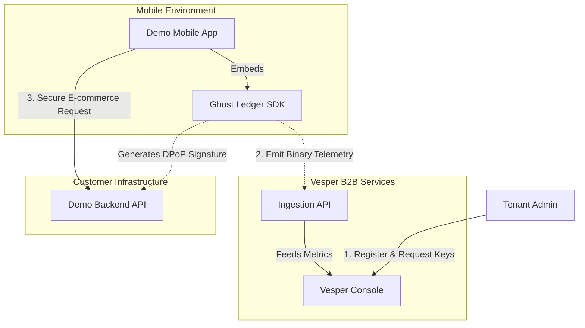

# V.E.S.P.E.R. Core Platform

[](https://vesper-console.netlify.app/)
[](https://vesper-ingestion.onrender.com/)
[](https://demo-backend-4puz.onrender.com/)
[](./packages/ghost-ledger)

This repository contains the **V.E.S.P.E.R. (Volatile Enclave for Secure Payload Encryption & Routing)** Developer Platform. It is a comprehensive B2B SaaS system and Zero-Trust cryptographic ecosystem providing core telemetry ingestion APIs, a management portal, a native C++ security SDK, and complete sample reference applications (mobile and backend) demonstrating how to implement a Zero-Trust architecture.

## Live Environments

You can explore the deployed platform and API implementations via the following public URLs:

| Service | Live URL | Hosting |
| :--- | :--- | :--- |
| **Vesper Console (Frontend)** | [vesper-console.netlify.app](https://vesper-console.netlify.app/) | Netlify |
| **Vesper Ingestion (API)** | [vesper-ingestion.onrender.com](https://vesper-ingestion.onrender.com/) | Render |
| **Demo Backend (E-commerce)**| [demo-backend-4puz.onrender.com](https://demo-backend-4puz.onrender.com/) | Render |

---

## Why V.E.S.P.E.R.? (The Zero-Trust Philosophy)

Modern mobile applications are inherently vulnerable. Attackers can reverse-engineer standard APIs, extract static JWT Bearer tokens to perform replay attacks, or use dynamic instrumentation tools (like Frida) to manipulate memory and bypass security checks at runtime. 

The **V.E.S.P.E.R.** architecture solves this by applying strict **Zero-Trust** principles through multiple defense layers:

1. **Volatile Enclave (Memory Isolation):** Sensitive cryptographic operations do not happen in the vulnerable JavaScript runtime. They are executed directly in a native C++ Volatile RAM Ledger that actively detects memory tampering and triggers an `IntegrityBreachError` if hooked.
2. **Secure Payload Encryption (DPoP & HMAC):** Instead of relying solely on a static Bearer token, the mobile client uses an ephemeral ECDSA key pair to dynamically sign *every single HTTP request*. Request bodies are also cryptographically hashed via HMAC-SHA256. A stolen token is useless without the private key, and payloads cannot be altered in transit (MitM).
3. **Routing & Active Telemetry:** When tampering is detected locally on the device, the C++ SDK bypasses standard HTTP layers to emit a 17-byte XOR-encrypted binary payload. This gets routed directly to the Vesper Ingestion API, alerting administrators in real-time.

---

## Ecosystem Architecture

To implement this philosophy, the project is structured as a monorepo containing the core platform, the security library, and the integration examples:

1. **[`vesper-ingestion`](./apps/vesper-ingestion)** (Backend - Go)
   - A high-performance Go HTTP server using `go-chi`.
   - Exposes REST endpoints for B2B SaaS authentication and API Key generation.
   - Exposes a binary ingestion endpoint (`/api/v1/support/telemetry`) that receives raw, XOR-encrypted telemetry data from client SDKs.
   - Forwards telemetry to OpenTelemetry collectors and stores a local copy in SQLite.

2. **[`vesper-console`](./apps/vesper-console)** (Frontend - Astro)
   - A lightweight, fast frontend built in Astro and hydrated with React ("Islands Architecture").
   - Allows organizations to manage their tenant profiles and generate `X-Sovereign-API-Key` strings for their mobile apps.
   - Features a real-time dashboard using **Recharts** that visualizes incoming telemetry metrics.

3. **[`@vesper-core/ghost-ledger`](./packages/ghost-ledger)** (SDK - C++/TypeScript)
   - The native cryptographic engine that integrates securely into client mobile applications.
   - Calculates dynamic DPoP signatures and detects memory tampering via its C++ Volatile RAM Ledger.

4. **[`demo-backend`](./examples/demo-backend)** (Backend - Go)
   - A sample reference implementation of an E-commerce API built with Clean Architecture.
   - Acts as the verifier. It strictly validates the ECDSA DPoP signatures and HMAC payloads generated by the mobile SDK before fulfilling business logic (like checkouts).

5. **[`demo-mobile`](./examples/demo-mobile)** (Mobile - React Native)
   - A sample mobile e-commerce application demonstrating the proper integration of the `@vesper-core/ghost-ledger` library.

### Full System Workflow



---

## Getting Started

### 1. Run the Telemetry API Backend
```bash
cd apps/vesper-ingestion
go mod download
go run ./cmd/server
```
*The server will run on `http://127.0.0.1:8081`.*
*SQLite database `telemetry.db` will be automatically generated and seeded.*

### 2. Run the B2B Portal
```bash
cd apps/vesper-console
npm install
npm run dev
```
*The portal will run on `http://localhost:4000` (port fixed in `package.json`, not Astro's default 4321).*

### Database Management
To clear the SQLite database in `vesper-ingestion` and start fresh:
```bash
cd apps/vesper-ingestion
go run ./cmd/cli clean-db
```

---

## API Testing with Bruno

This repository includes a native [Bruno](https://www.usebruno.com/) collection for API testing:
> [!TIP]
> Ensure you select the `Local` environment in Bruno so the `{{base_url}}` points to `http://127.0.0.1:8081` (Ingestion) or `http://127.0.0.1:8080` (Demo Backend).

- **`bruno/demo-backend/`**: Contains the E-Commerce backend endpoints. **Note:** Most endpoints will fail without the Development Bypasses enabled due to strict DPoP validations.
- **`bruno/vesper-ingestion/`**: Contains the B2B Auth and Ingestion endpoints.

### Ingestion Endpoints Overview

| Method | Endpoint | Description |
| :--- | :--- | :--- |
| `POST` | `/api/v1/b2b/signup` | Register new tenant |
| `POST` | `/api/v1/b2b/login` | Authenticate |
| `POST` | `/api/v1/b2b/keys` | Generate SDK key |
| `GET` | `/api/v1/b2b/keys` | List keys |
| `DELETE` | `/api/v1/b2b/keys` | Delete an SDK key |
| `GET` | `/api/v1/b2b/metrics` | Real-time data for the chart |
| `GET` | `/api/v1/support/ping` | Health check |
| `POST` | `/api/v1/support/telemetry` | SDK Binary ingestion |

---

## Continuous Integration & Security Pipelines

This repository enforces strict CI/CD and security testing via GitHub Actions:

<details>
<summary><strong>View Pipeline Workflows</strong></summary>

### 1. Vesper Ghost Ledger CI (`ghost-ledger-ci.yml`)
Ensures the structural integrity of the native cryptographic library:
- **`cpp-tests`**: Uses CMake to build and run the pure C++ core tests natively on Ubuntu.
- **`js-lint-test`**: Validates the TypeScript specs and runs pure JS fallback engine unit tests.

### 2. Demo Mobile App CI (`demo-mobile-ci.yml`)
Tests the mobile application and runs live anti-tampering validation:
- **`lint-and-test`**: Lints and tests the React Native codebase.
- **`build-android` & `build-ios`**: Assembles the Android APK (Gradle) and iOS Simulator build (Xcodebuild).
- **`security-dast` (Anti-Tampering Cross-Test)**: Boots a headless Android emulator with KVM acceleration. It then injects **Frida** into the compiled APK to simulate a real-world memory tampering attack. This guarantees the `IntegrityBreachError` mechanism functions flawlessly against dynamic runtime hooks. It posts the security report directly to Pull Requests.

</details>

---

## Security, Compliance & Operational Resilience Documentation

Comprehensive technical specifications, threat models, and operational resilience frameworks are documented in the [`docs/`](./docs) directory:

| Document | Primary Focus | Regulatory / Industry Standard |
| :--- | :--- | :--- |
| [**Business Impact Analysis (BIA)**](./docs/business_context_bia.md) | Quantitative recovery metrics ($RTO < 100\text{ms}$, $RPO = 0\text{s}$, MTPD), tiering hierarchy, and BCP execution sequence. | ISO 22301:2019 Cl. 8.2.2, DORA Art. 11 |
| [**DORA Operational Resilience**](./docs/compliance/dora_operational_resilience.md) | ICT risk management, zero-disk volatile memory policy, and Threat-Led Penetration Testing (TLPT) automation via Frida. | Regulation (EU) 2022/2554 |
| [**NIST CSF 2.0 Gap Analysis**](./docs/compliance/gap_analysis_nist_csf.md) | Assessment across Govern, Identify, Protect, Detect, Respond, Recover; prioritized engineering roadmap to Tier 4. | NIST CSF 2.0 |
| [**BCP & DRP Operational Runbook**](./docs/operational_resilience/bcp_drp_runbook.md) | Standard Operating Procedures for edge sequestration, telemetry triage, backend reconciliation, and kill-switch revocation. | ISO 22301 Cl. 8.4, SRE SOP |
| [**Cryptographic Specification**](./docs/compliance/cryptographic_spec.md) | Mathematical specifications for DPoP (RFC 9449), HMAC-SHA256, and SHA-256 block hash chaining. | FIPS 180-4, RFC 9449 |
| [**Secure Memory Policy**](./docs/compliance/secure_memory_policy.md) | Compiler Dead Store Elimination (DSE) barriers, deterministic TTL zeroization, and zero-disk policy. | PCI-DSS v4.0 Req 3.2, GDPR Art. 32 |
| [**STRIDE Threat Model**](./docs/compliance/stride_threat_model.md) | Endpoint and transport threat enumeration, attack surface mitigations, and fail-secure countermeasures. | Microsoft STRIDE Framework |

---

## License

This project is proprietary software. See the [LICENSE](./LICENSE) file for details.
