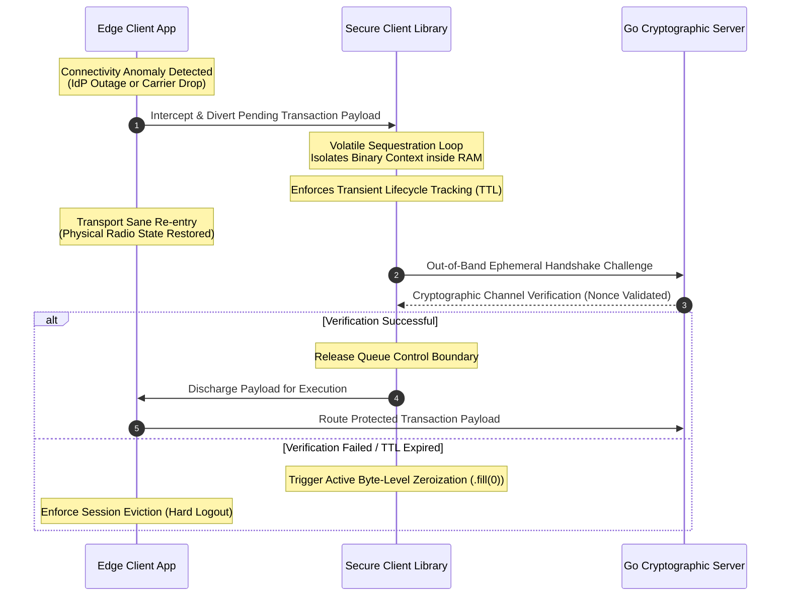

# SovereignCore Platform: Architectural Specification and Core Blueprint

SovereignCore is an enterprise-grade cryptographic resilience library and decentralized software ecosystem designed to guarantee transaction survivability during cloud Identity Provider (IdP) infrastructure drops and critical transport network degradation. 

By separating logical session survivability from persistent local storage, the platform mitigates client-side data visibility risks without enforcing immediate user eviction or causing transactional drop-offs. SovereignCore establishes an isolated, time-bounded, volatile memory (RAM) containment architecture, enforcing state security over untrusted edge environments while matching rigorous data-at-rest and data-in-transit regulatory mandates.

---

## 1. Architectural Topology: Decoupled Multi-Project Layout

The SovereignCore repository enforces a strictly segregated, autonomous multi-project topology. Each subsystem functions as an independent, self-contained codebase with its own localized dependency trees and execution perimeters. This absolute segregation guarantees context isolation across environments, ensuring that individual runtime boundaries are preserved and deployment pipelines remain decoupled.

```text
sovereign-core-platform/            # SovereignCore Root Git Boundary
├── docs/                           # Strategic BIA, Risk Analysis, and Compliance Vectors
├── packages/
│   └── secure-client/              # Core Interceptor Library & Volatile RAM Lifecycle Custodian
└── apps/
    ├── backend-api/                # High-Concurrency Cryptographic Validation & Telemetry Server (Go)
    ├── web-support-portal/         # Administrative Telemetry & Real-Time Security Dashboard (Next.js)
    └── mobile-app/                 # Target Mobile Verification Client (Expo SDK 54 Native)
```

---

## 2. Subsystem Directory Specification

### 2.1. Repository Root (`sovereign-core-platform/`)
Defines the global revision control perimeter and foundational environmental exclusions (`.gitignore`). It establishes clean configuration boundaries to preserve the structural autonomy of all internal packages and applications.

### 2.2. Strategy and Risk Documentation (`docs/`)
Acts as the single source of truth for the project's regulatory posture and business logic alignment. It maintains the formal Business Impact Analysis (BIA), mapping infrastructure outage vectors directly to financial transaction metrics, operational risk modeling, and compliance alignment profiles for internal and external auditing.

### 2.3. Core Interceptor Library (`packages/secure-client/`)
The primary software asset of the ecosystem. Engineered as an agnostic, universal TypeScript library utilizing the Interceptor pattern, it hooks into client-side transport abstractions. During connectivity dropouts, it temporarily sequesters transaction payloads within an isolated runtime memory segment, forbidding local disk storage footprints. It manages in-memory object lifecycles via deterministic, byte-level zeroization procedures and emits passive initialization telemetry heartbeats to the central Go infrastructure.

### 2.4. Cryptographic & Telemetry Server (`apps/backend-api/`)
A lightweight, high-throughput microservice built natively in Go utilizing the standard library to maintain a minimal attack surface. It governs server-side security enforcement, processing incoming token validation challenges and validating client memory chain integrity upon network restoration. Additionally, it serves as the centralized ingest gate, processing concurrent, decentralized initialization pings via lightweight Go routines.

### 2.5. Administrative Telemetry Console (`apps/web-support-portal/`)
A server-rendered administrative interface developed using Next.js 15 and React 19. It consumes real-time telemetry streams and operational metrics directly from the Go service edge using low-latency reactive channels (WebSockets/Server-Sent Events). It provides security operations teams with a live diagnostic dashboard to monitor active in-memory payloads, transaction suspension rates, SDK adoption metrics, and authentication telemetry anomalies.

### 2.6. Target Mobile Verification Client (`apps/mobile-app/`)
The client-facing runtime validation environment built on native Expo SDK 54. To maintain structural stability with React 19 architectures and ensure cross-platform layout performance, it relies entirely on the native `StyleSheet` engine, eliminating external pre-processing dependencies. It consumes the core client library via relative file-system paths, stabilizing the native bridging layer (TurboModules) within physical device boundaries.

---

## 3. Threat Mitigation and Security Pillars

SovereignCore re-engineers edge execution security parameters by implementing a defense-in-depth model that addresses critical vulnerabilities highlighted in the OWASP Mobile Application Security Verification Standard (MASVS):

| Security Principle | Technical Enforcement Mechanism | Regulatory Compliance Target |
| :--- | :--- | :--- |
| **Zero-Disk Storage Footprint** | Complete prohibition of unsubmitted payload writes to persistent flash layers (`AsyncStorage`, SQLite, local log files). Prevents physical data extraction from stolen or compromised devices. | OWASP MASVS-STORAGE-1<br>PCI-DSS v4.0 Req 3.2 |
| **Transient Memory Isolation** | Payload containment within non-global, sandboxed JavaScript execution contexts. Isolates data-in-flight from horizontal runtime exploitation hooks. | OWASP MASVS-RESILIENCE |
| **Active Byte-Level Zeroization** | Implements deterministic Time-To-Live (TTL) cycles. Before garbage collection pointer release, memory blocks are actively overwritten with binary zeroes to neutralize physical memory scrubbing. | Anti-Cold Boot Attack Vectors<br>Memory Dump Safeguards |
| **Cryptographic Re-Handshake** | Network re-entry locks outbound transmission queues until an ephemeral cryptographic challenge (Nonces/Time-variant signatures) is verified with the Go server. | OWASP MASVS-NETWORK-1<br>MitM & Replay Mitigation |

---

## 4. Operational Data Flow Matrix



1. **Connectivity Anomaly Detection:** Runtime state listeners inside `apps/mobile-app/` detect an operational identity provider or bearer transport drop.
2. **Volatile Sequestration:** The transaction routing layer diverts the pending data packet to `packages/secure-client/`, initiating the memory lifecycle isolation sequence.
3. **Transport Sane Re-entry:** The physical radio interface recovers connection parameters and communicates readiness back to the application context.
4. **Channel Legitimacy Challenge:** `packages/secure-client/` intercepts the stack, holding outgoing business payloads until an out-of-band cryptographic handshake is successfully negotiated with `apps/backend-api/`.
5. **Payload Discharge:** Upon backend validation of the transaction channel integrity, the temporary RAM cache discharges the payload to the server-side architecture and triggers localized garbage collection zeroization.

---

## 5. Cryptographic Chain Formulation

To ensure the block sequence integrity of transaction payloads sequestered inside volatile memory, the library links each payload node using an un-hashed back-reference state. The calculation execution string for block $n$ relies on the following mathematical function:

$$H_n = \text{SHA256}(P_n \parallel H_{n-1} \parallel Timestamp_{local})$$
