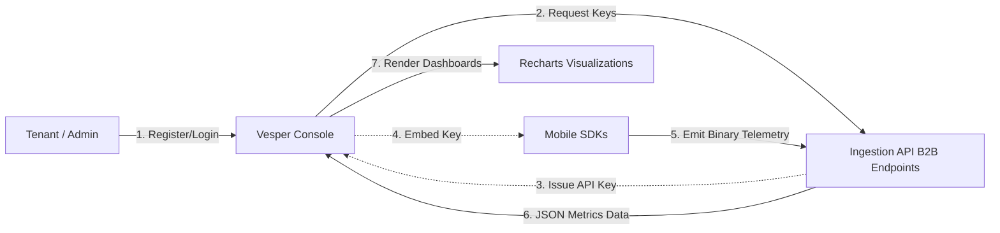

# Vesper Console (B2B Frontend)

> [!NOTE]
> **Context:** This is the administrative frontend for the Vesper Developer Platform. It provides a B2B portal where tenant organizations can register, manage their API keys, and monitor real-time security telemetry from their deployed mobile SDKs.

[](https://vesper-console.netlify.app/)

Welcome to the frontend portal for the Vesper Developer Platform. It is built using a modern **Astro + React** stack and styled with **Tailwind CSS**.

## Live Environment

The production build of this portal is continuously deployed on Netlify. You can access the live dashboard here:
**[https://vesper-console.netlify.app/](https://vesper-console.netlify.app/)**

---

## What is Vesper Console?

`vesper-console` is the primary web interface that developers and administrators interact with to use the Vesper platform. Instead of managing the cryptography and SDKs manually, a tenant (e.g., an E-commerce company) uses this console to:

1. **Register a Tenant Account:** Create an organization profile within the platform.
2. **Generate API Keys:** Mint cryptographic `X-Sovereign-API-Key` strings. These keys are strictly bound to a mobile application's `bundle_id` (e.g., `com.democorp.app`) and are required to initialize the C++ `ghost-ledger` SDK on iOS and Android.
3. **Monitor SDK Telemetry:** View live charts detailing cryptographic performance (latency) and security events (integrity breaches, memory tampering) reported by mobile clients globally.

---

## Architecture & Features

This project utilizes an "Islands Architecture" pattern to deliver a fast, mostly-static HTML shell while selectively hydrating interactive components.

- **Astro + React Islands**: The core routing and layout (Landing, Login, Dashboard pages) are statically generated by Astro. However, highly interactive widgets (like the `TelemetryPanel.tsx` or `ApiKeyManager.tsx`) are written in React and hydrated on the client side using `@astrojs/react`.
- **Real-time Telemetry Dashboard**: Visualizes incoming SDK integrity failures, timeouts, and latency metrics dynamically using **Recharts**.
- **Offline Mock Generator**: If the backend Ingestion API is unreachable, the telemetry panel automatically falls back to an offline mock generator that simulates data (integrity breaches, latency spikes) for local UI/UX testing without a backend.
- **Internationalization (i18n)**: Implements `react-i18next` for seamless multi-language support across the dashboard.
- **Tailwind CSS**: Utility-first styling for rapid, responsive UI development.

## System Workflow



---

## Environment Variables

The console requires environment variables to know where the backend ingestion core is located. You can configure this by creating a `.env` file in the root of `apps/vesper-console`.

| Variable | Description |
| :--- | :--- |
| `PUBLIC_API_URL` | **Optional.** The base URL of the `vesper-ingestion` API. Defaults to `http://127.0.0.1:8081` if not provided. Must be prefixed with `PUBLIC_` so Astro exposes it to the client-side React components. |

---

## Local Development & Commands

### Prerequisites
- Node.js (v22+)

### Run & Build

1. Navigate to the console directory:
   ```bash
   cd apps/vesper-console
   ```
2. Install dependencies:
   ```bash
   npm install
   ```

| Command | Description |
| :--- | :--- |
| `npm run dev` | Starts the Astro development server on port `4000`. |
| `npm run build` | Builds the site for production into the `dist/` directory. |
| `npm run preview` | Serves the production `dist/` directory locally to preview the build. |

> [!TIP]
> The development server forces port `4000` via `package.json` to avoid colliding with Astro's default `4321`. Navigate to `http://localhost:4000` to view the portal.

### Testing & Quality
| Command | Description |
| :--- | :--- |
| `npm run test` | Runs the Vitest test suite. |
| `npm run coverage` | Runs Vitest and generates a v8 coverage report. |
