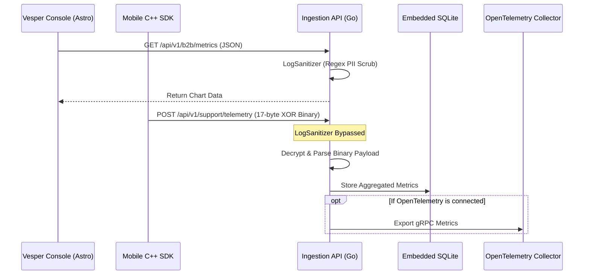

# Vesper Ingestion API (`vesper-ingestion`)

> [!NOTE]
> **Context:** This service is the telemetry ingestion core for the Vesper Developer Platform. It acts as the B2B backend where tenant organizations register, generate API Keys, and where their mobile apps send secure metrics about tampering attempts.

Welcome to the backend ingestion core for the Vesper Developer Platform. Built in **Go**, it handles high-throughput telemetry streams from mobile SDKs.

## Live Environment

The production build of this API is continuously deployed on Render. You can interact with the live Swagger documentation here:
**[https://vesper-ingestion.onrender.com/swagger/index.html](https://vesper-ingestion.onrender.com/swagger/index.html)**

---

## Architecture & Features

This service handles both traditional JSON requests (for the B2B web console) and high-performance binary streams (for mobile Edge telemetry). 

### Telemetry Pipeline (Binary vs Text)

- **B2B Endpoints (`/api/v1/b2b`)**: Standard JSON endpoints used by the `vesper-console` (Astro) for managing tenants, API keys, and retrieving metrics. These routes are protected by a **Zero-Trust Log Sanitizer** middleware that uses Regex to scrub accidental PII before processing.
- **Binary Telemetry (`/api/v1/support/telemetry`)**: The ingestion endpoint receives raw 17-byte XOR-encrypted binary payloads directly from the C++ SDK. The Regex Log Sanitizer is intentionally **not** mounted here, as regex parsing would corrupt the binary stream and make XOR decoding produce garbage values.

### Persistence & Exporting

- **Embedded SQLite**: Uses a local SQLite database (`telemetry.db`) natively for managing tenant accounts, API keys, and charting metrics without requiring an external DB cluster.
- **OpenTelemetry Export**: At startup, it attempts to connect to an external OpenTelemetry collector. If unavailable, it gracefully degrades to a `NoopForwarder` and stores events locally in SQLite only.

---

## Security & Reliability Features

1. **API Key Validation**: The telemetry endpoint requires an `X-Sovereign-API-Key` header, which is strictly validated against the SQLite database using the `ApiKeyValidator` middleware before any binary processing begins.
2. **Strict CORS Configuration**: Configured explicitly to allow cross-origin requests from the Vesper Console (`http://localhost:4000` in development).

---

## Environment Variables

The server relies on the following environment variables to run. Note that the service will intentionally crash on startup if critical secrets are missing or weak.

| Variable | Description |
| :--- | :--- |
| `JWT_SECRET` | **Required.** Must be at least 32 characters long. Used for signing and validating HS256 JWT sessions for tenant accounts. The server will `panic` on startup if this is missing or too short to prevent running with weak encryption. |
| `DB_PATH` | **Optional.** Path to the SQLite database file. Defaults to `telemetry.db`. |
| `ALLOWED_ORIGINS` | **Optional.** Configures CORS. Defaults to allowing `http://localhost:4000` and `http://localhost:3000`. |

---

## Local Development & Commands

To run this backend locally, ensure you have **Go 1.22+** installed. 

### Run & Build
| Command | Description |
| :--- | :--- |
| `go mod tidy` | Cleans up and installs Go modules dependencies. |
| `go run ./cmd/server` | Starts the local development server on port `8081`. |
| `go build -o bin/server ./cmd/server` | Compiles the server into an executable binary. |

> [!TIP]
> The server will start on port `8081` (not `8080`) to avoid port collisions with the E-Commerce `demo-backend`.

### Database Management CLI
| Command | Description |
| :--- | :--- |
| `go run ./cmd/cli clean-db` | Drops all records from the SQLite database. Seed data will be recreated automatically the next time the server starts. |

### Documentation
| Command | Description |
| :--- | :--- |
| `swag init -g cmd/server/main.go` | Generates the Swagger OpenAPI documentation. |
