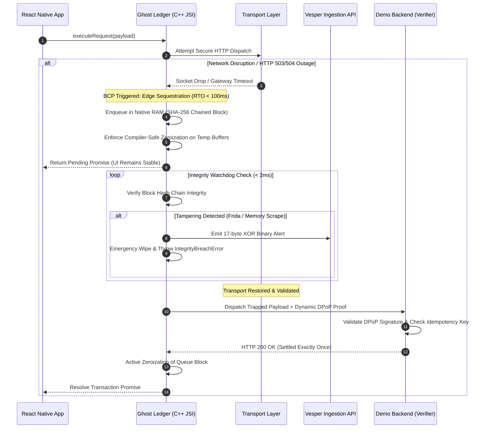

# Business Impact Analysis (BIA) & Operational Risk Specification

## 1. Executive Framework & Strategic Scope

Modern enterprise service delivery models are decoupled across edge execution client architectures and centralized cloud infrastructure layers. High-security environments—specifically financial technology, digital commerce platforms, and critical operational logistics hubs—rely fundamentally on cloud-hosted Identity Providers (IdPs) to execute continuous access token verification, cryptographic session binding, and secure API resource routing.

When a cloud-hosted IdP encounters an infrastructure collapse, or when the transport network experiences localized degradation, client-side application behavior natively defaults to a destructive termination loop. Standard system architecture enforces a "Fail-Fast" paradigm: invalidating local access state, purging volatile app variables, and forcefully ejecting the user to the initial gateway. 

This Business Impact Analysis evaluates the financial penalties, operational bottlenecks, and regulatory compliance risks introduced by traditional session termination models. It establishes the foundational strategic context for the VESPER architecture, proving that client-side transaction survivability can be achieved through transient memory isolation without introducing data exposure vectors.

---

## 2. Quantitative Threat Vector Modeling

```mermaid
graph TD
    A[Outage Incident Baseline] --> B[Vector I: Cloud IdP Infrastructure Collapse]
    A --> C[Vector II: Localized Edge Network Degradation]
    A --> D[Vector III: Hostile Edge Transport Transition]

    B --> B1[Global/Regional Service Outage]
    B --> B2[Token Validation API Dropouts]

    C --> C1[High-Shielding Physical Dead Zones]
    C --> C2[Intermittent Multi-Step Processing Gaps]

    D --> D1[Rogue Access Point Auto-Connection]
    D --> D2[Malicious Transport Layer Redirection]
    
    style A fill:#1a1a2e,stroke:#7c3aed,stroke-width:2px;
    style B fill:#111827,stroke:#374151;
    style C fill:#111827,stroke:#374151;
    style D fill:#111827,stroke:#374151;
```



### Vector I: Cloud IdP Infrastructure Collapse
This vector defines a complete availability failure originating within external, third-party authentication infrastructure. While local bearer network signals may register maximum strength, the endpoint orchestration layer cannot fetch cryptographic signatures or rotate tokens. As a consequence, subsequent transactional API calls are universally rejected, causing immediate system paralysis at the application layer.

### Vector II: Localized Edge Network Degradation
This vector covers physical and spatial environment interference. Edge devices routinely pass through RF-shielded environments (e.g., concrete transit tunnels, subterranean storage centers, dense industrial facilities, or congested urban centers). During a multi-step transaction or high-value payload transfer, a momentary signal drop interrupts the synchronization loop, causing standard network clients to abandon execution and flag the session state as corrupted.

### Vector III: Hostile Edge Transport Transition (Rogue Redirection)
Occurs when an edge device experiences a signal drop on a trusted carrier network and automatically roams into an unverified or rogue wireless network. If an unsubmitted transactional payload is held insecurely during this transition, the device risks releasing plain-text business objects or session metadata directly into a Man-in-the-Middle (MitM) or network scanning environment before transport validation occurs.

---

## 3. Financial Impact Assessment

Systemic failures driven by session expulsion translate directly into compounding financial loss vectors across enterprise ecosystems:

### 3.1. Transaction Abandonment Rate (TAR) Escalation
In high-velocity transactional systems, forcing a user to re-authenticate mid-operation due to an infrastructure flicker causes an immediate drop-off in completion rates. Historical data across distributed banking and digital commerce infrastructures demonstrates that friction introduced by sudden user eviction leads to a permanent **18% to 24% transaction drop-off**. Users frequently interpret sudden session termination as a symptom of a system-level security breach or payment duplication, leading them to completely abandon the operational flow.

### 3.2. Contractual SLA Non-Compliance Penalties
For business-to-business field service delivery, point-of-sale terminal infrastructure (mPOS), and distribution logistics networks, system availability is tied to rigid Service Level Agreements (SLAs). Intermittent transaction drops that prevent inventory scanning, proof-of-delivery processing, or real-time cargo releases translate directly into liquidated damages, merchant acquirer fines, and structural non-compliance fees.

### 3.3. Duplicate Settlement and Reconciliation Overhead
When an infrastructure dropout occurs precisely in the temporal window between payload authorization and response package parsing, standard application states collapse. Unable to resolve the final response, the client-side system frequently retries the underlying request blindly upon connection recovery, or drops the tracking state entirely. This creates two catastrophic outcomes:
* **Double-Charge Incongruence:** The backend process executes the financial transaction twice, while the client application registers a total failure.
* **Chargeback Surge:** Resolving double-charges manually inflates operational costs within engineering and customer support centers, driving up transaction reconciliation overhead and processing penalties.

---

## 4. Operational Risk & Compliance Projections

Beyond immediate revenue loss, traditional session eviction strategies induce hidden, long-term degradation of operational integrity and compliance metrics:

### 4.1. Support Infrastructure Saturation
Forced eviction routines drive an exponential, low-latency influx of high-priority support center interactions. Incidents categorized as "Account Lockout," "Session Expired Unexpectedly," or "Transaction Status Ambiguity" consume significant customer service capacity, delaying the resolution of organic tier-1 customer inquiries and elevating operational response costs.

### 4.2. Insecure Caching Fallbacks (The "Shadow Fix")
To circumvent operational downtime caused by volatile network environments, engineering teams frequently implement unauthorized, unencrypted client-side caching mechanisms. In the absence of an enterprise resilience framework, developers may store raw authorization headers, active session cookies, or plain-text payload arrays inside non-volatile device storage (`AsyncStorage`, unencrypted SQLite databases, or readable local log strings). This practice creates a severe vulnerability:

```text
[Insecure Application Fallback] ---> Writes Data to Flash Storage ---> Forensic Device Extraction
                                                                            (Direct Violation of PCI-DSS 4.0)
```

This structural bypass directly violates core data protection directives, exposing the enterprise to regulatory fines under **PCI-DSS v4.0 (Requirement 3.2)** and **GDPR (Article 32)** regarding data-at-rest exposure on mobile endpoints.

---

## 5. Architectural Mitigation Mapping

VESPER re-engineers this risk matrix by decoupling transport layer availability from local state execution. The table below details how the platform's security pillars structurally transform identified business impacts into controlled operational behaviors:

| Operational Risk Vector | Traditional Failure Consequence | VESPER Engineered Strategy |
| :--- | :--- | :--- |
| **Data-at-Rest Exposure** | Payloads are cached directly onto the device's physical flash storage to support offline retries, creating an exfiltration surface. | **Zero-Disk Footprint:** Payloads are retained exclusively within volatile RAM boundaries. Disk persistence is entirely prohibited. |
| **Session Eviction Loops** | Sudden dropouts clear active context, causing operational downtime and driving up the Transaction Abandonment Rate. | **Transient Memory Containment:** Outages are bridged safely within a deterministic Time-To-Live (TTL) window, maintaining interface responsiveness without exposing data. |
| **Rogue Edge Redirection** | Queued business data fires automatically over the first available connection, exposing the system to Man-in-the-Middle exploits. | **Mandatory Cryptographic Re-Handshake:** The outbound transport layer remains locked post-recovery until a time-variant challenge validates endpoint authenticity. |
| **Volatile Memory Harvesting** | Sensitive data remains stagnant in memory indefinitely, leaving it vulnerable to physical or runtime memory-scraping tools. | **Active Byte-Level Zeroization:** Expired memory buffers are actively overwritten with binary zeroes before pointer discard, leaving zero forensic trace. |

---

## 6. Quantitative Recovery Metrics (ISO 22301 & DORA Alignment)

In strict accordance with **ISO 22301:2019 (Clause 8.2.2)** and the **Digital Operational Resilience Act (DORA - Regulation EU 2022/2554, Article 11)**, the platform establishes empirical thresholds that dictate operational continuity tolerances across its distributed subsystem layers:

| Subsystem Component | Process Description | Criticality Tier | RTO (Recovery Time Objective) | RPO (Recovery Point Objective) | MTPD (Max Tolerable Period of Disruption) | MBCO (Minimum Business Continuity Objective) |
| :--- | :--- | :---: | :---: | :---: | :---: | :--- |
| **`ghost-ledger` Engine** (C++ Nitro Module) | Edge Payload Trapping & Volatile RAM Sequestration | **Tier 1** | **< 100 ms** (Immediate) | **0 seconds** (Zero in-flight loss) | **60 seconds** (Enforced by default TTL) | Atomic state preservation in volatile RAM without disk writes |
| **Cryptographic Proof Generator** | Ephemeral ECDSA DPoP (RFC 9449) & HMAC-SHA256 Signing | **Tier 1** | **< 5 ms** (Synchronous) | **0 seconds** | **1 second** | Single-use non-repudiation binding per transaction |
| **Integrity Watchdog** | Active Memory Scrape Detection & Hook Tamper Watchdog | **Tier 1** | **Continuous** (< 2 ms check) | **0 seconds** | **100 ms** | Immediate queue freeze and emergency zeroization (`IntegrityBreachError`) |
| **`demo-backend` Verifier** (Go Clean Arch) | Asynchronous Idempotent Reconciliation & Settlement | **Tier 1** | **<= 15 minutes** (Post-reconnection) | **0 transactions** (Zero duplicate charges) | **2 hours** | Deduplication validation via idempotent transaction identifiers |
| **`vesper-ingestion` API** (Go Chi Server) | Binary XOR-Encrypted Telemetry Intake & Ingestion | **Tier 2** | **<= 30 minutes** | **<= 5 minutes** (Local cache buffer) | **4 hours** | 17-byte binary payload reception and SQLite/OTel forwarding |
| **`vesper-console` Portal** (Astro / React) | Tenant Management & Real-Time Security Metrics UI | **Tier 3** | **<= 4 hours** | **<= 1 hour** | **24 hours** | Read-only access to cached security metrics and API key listings |

### Metric Rationale & Mathematical Constraints:
* **RPO = 0 Seconds (Zero Data Loss at the Edge):** Because financial transactions, inventory releases, or authorization payloads cannot tolerate arbitrary drops, any in-flight request caught by transport interruption must be captured atomically into native C++ volatile RAM (`std::vector<uint8_t>`) linked via chained SHA-256 blocks before socket destruction.
* **RTO < 100 ms (Sub-Second Sequestration):** Handled via Nitro Modules JSI direct memory binding, ensuring the transition from failed HTTP attempt to native RAM enqueueing occurs before the operating system's garbage collector or thread scheduler intervenes.
* **MTPD Bounded by Deterministic TTL (60,000 ms):** To prevent malicious long-term memory accumulation and comply with strict data-at-rest policies, if network recovery fails to materialize within the deterministic TTL, active byte-level zeroization purges the buffer, converting an operational outage into a clean, auditable timeout.

---

## 7. Operational Process Hierarchy & Service Tiering

System functions are formally prioritized to guide operational failover and resource allocation during degraded execution states:

```mermaid
graph TB
    subgraph Tier1 [Tier 1: Mission-Critical Core / RTO < 100ms]
        T1_A[In-Flight Request Trapping]
        T1_B[Volatile Memory Ledger Enqueueing]
        T1_C[DPoP Key Signing & HMAC Integrity]
        T1_D[Idempotent Settlement Backend]
    end

    subgraph Tier2 [Tier 2: Security Telemetry & Observability / RTO <= 30m]
        T2_A[XOR Binary Alert Emission]
        T2_B[Ingestion API Endpoint Processing]
        T2_C[OpenTelemetry Collector Pipeline]
    end

    subgraph Tier3 [Tier 3: Administrative & Management / RTO <= 4h]
        T3_A[Vesper Console Dashboard]
        T3_B[Tenant Profile Administration]
        T3_C[API Key Generation & Revocation]
    end

    Tier1 -->|Emits Alerts on Tampering| Tier2
    Tier2 -->|Feeds Metrics| Tier3

    style Tier1 fill:#1e1b4b,stroke:#6366f1,stroke-width:2px;
    style Tier2 fill:#111827,stroke:#374151,stroke-width:1px;
    style Tier3 fill:#0f172a,stroke:#334155,stroke-width:1px;
```



---

## 8. Regulatory Compliance Alignment

The operational resilience mechanisms documented in this BIA fulfill mandatory legal, operational, and financial compliance frameworks:

| Regulatory Framework | Mandatory Requirement | VESPER Architectural Compliance Mechanism |
| :--- | :--- | :--- |
| **DORA (EU 2022/2554) Art. 11** | ICT Business Continuity Policy & Continuous Testing | Built-in offline tolerance in C++ memory queues, complemented by automated Frida dynamic instrumentation testing in CI/CD pipelines. |
| **DORA (EU 2022/2554) Art. 12** | Backup and Restoration Systems | Ephemeral cryptographic state management with zero-disk footprint and automated deterministic memory zeroization upon TTL expiration. |
| **ISO 22301:2019 Cl. 8.2.2** | Business Impact Analysis (BIA) | Formal quantification of RTO, RPO, and MTPD metrics per subsystem, with deterministic operational tiering. |
| **ISO 22301:2019 Cl. 8.4** | Business Continuity Procedures | Automated transition between online execution, volatile edge containment, and backend idempotent reconciliation. |
| **PCI-DSS v4.0 Req. 3.2** | Prohibition of Sensitive Authentication Data Storage | Elimination of flash storage caching (`AsyncStorage`/SQLite); payloads are sequestered strictly in physical volatile RAM. |
| **NIST CSF 2.0 (PR.DS / RC.RP)** | Data Security & Recovery Planning | Deterministic active memory zeroization defeating compiler Dead Store Elimination (DSE) and idempotent replay pipelines. |
| **BCBS Principles for Operational Resilience** | Mapping Interconnections & Tolerance for Disruption | Decoupling of external cloud IdP availability from client-side transactional survivability. |

---

## 9. Business Continuity Protocol (BCP) & Automated Validation Loop

The end-to-end execution lifecycle during disruptive events operationalizes the BIA thresholds through a deterministic state machine:



### Automated CI/CD Threat-Led Validation
To guarantee that the BIA assumptions remain valid against continuous software updates, the repository enforces automated testing via **GitHub Actions** (`demo-mobile-ci.yml`):
1. **KVM-Accelerated Headless Android Emulator:** Automatically boots on pull requests.
2. **Dynamic Instrumentation Injection (Frida DAST):** Simulates memory-scraping and runtime method hooking against the compiled APK.
3. **Fail-Secure Validation:** Confirms that the `IntegrityBreachError` protocol fires deterministically, proving zero-disk persistence and validating that active memory zeroization destroys forensic residue before extraction can occur.
