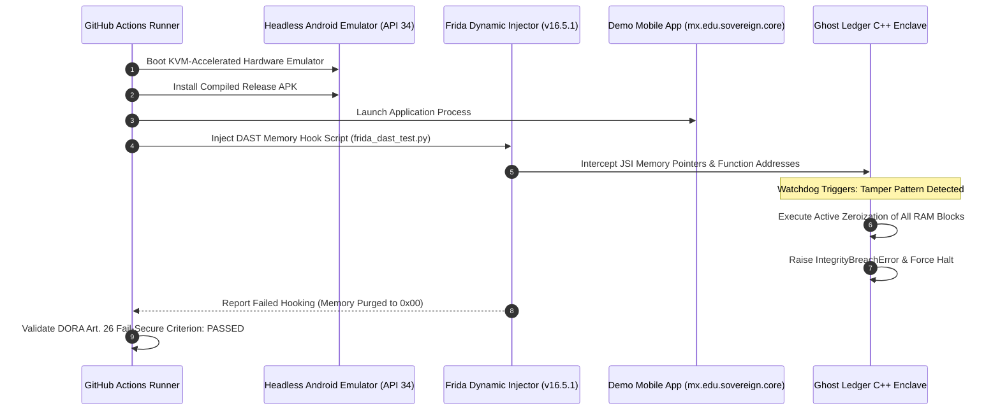

# Digital Operational Resilience Act (DORA) Technical Compliance Specification

> **Regulation Reference:** Regulation (EU) 2022/2554 on digital operational resilience for the financial sector  
> **Target Scope:** Vesper Core Platform (`@vesper-core/ghost-ledger`, `vesper-ingestion`, `demo-backend`)  
> **Status:** Fully Aligned | **Last Audit Date:** September 2026

---

## 1. Executive Mandate & Regulatory Scope

The European Union's **Digital Operational Resilience Act (DORA - Regulation EU 2022/2554)** mandates that financial entities and their critical ICT third-party service providers implement a comprehensive, integrated operational resilience framework. DORA shifts the regulatory paradigm from traditional periodic disaster recovery audits to continuous, active capability testing and fail-secure architecture.

This specification details how the **Vesper Core Platform** satisfies each relevant requirement of DORA Chapter II (ICT Risk Management Framework) and Chapter IV (Digital Operational Resilience Testing), specifically addressing:
1. **Article 9:** ICT Protection and Prevention Mechanisms.
2. **Article 11:** ICT Business Continuity Policy and Response/Recovery Plans.
3. **Article 12:** Backup Policies and Restoration Procedures (Zero-Disk Architecture).
4. **Article 13:** Learning and Evolving (Dynamic Telemetry & Continuous Improvement).
5. **Article 26:** Threat-Led Penetration Testing (TLPT) via automated CI/CD instrumentation.

---

## 2. Regulatory Compliance Crosswalk

The following matrix maps DORA articles to the exact architectural components within the Vesper Core Platform monorepo:

| DORA Article | Regulatory Obligation | Vesper Architectural Implementation | Verification Subsystem |
| :--- | :--- | :--- | :--- |
| **Art. 9(1) & (2)** | Minimize the impact of ICT risk; deploy resilient and secure ICT systems. | Zero-Trust transaction pipeline utilizing client-side DPoP (RFC 9449) and HMAC-SHA256 payload integrity signing. | `examples/demo-backend/internal/handler/middleware/dpop_auth.go` & `hash_validator.go` |
| **Art. 9(4)(c)** | Implement access control and identity management preventing credential misuse. | Cryptographic token binding via ephemeral ECDSA P-256 keys; private keys remain in hardware/native enclave. | `packages/ghost-ledger/src/dpop/signer.ts` & native C++ JSI |
| **Art. 11(1)** | Maintain a comprehensive ICT Business Continuity Policy. | Deterministic edge request trapping into a native C++ Volatile Ledger upon transport or IdP outage (RTO < 100ms). | `packages/ghost-ledger/cpp/VolatileQueue.hpp` & `docs/business_context_bia.md` |
| **Art. 11(2)(a)** | Ensure the continuity of critical operations and limit transaction abandonment. | Local hash-chained ledger retains in-flight business objects up to 60,000ms TTL without session termination. | `packages/ghost-ledger/cpp/VolatileQueue.hpp` & `src/ledger/index.ts` |
| **Art. 12(1) & (2)** | Backup policies and restoration methods minimizing data loss. | Ephemeral volatile memory containment eliminating physical disk writes (`AsyncStorage`/SQLite), zeroing RPO ($RPO = 0$). | `docs/compliance/secure_memory_policy.md` |
| **Art. 13(1)** | Implement incident detection, monitoring, and telemetry collection. | Real-time 17-byte XOR-encrypted binary anomaly telemetry dispatched to Ingestion API upon tampering detection. | `apps/vesper-ingestion/internal/handler/http/telemetry_handler.go` |
| **Art. 26(1) & (2)** | Conduct advanced Threat-Led Penetration Testing (TLPT) on live systems. | Automated dynamic instrumentation injection (Frida DAST) against compiled Android APK in headless KVM CI/CD. | `.github/workflows/demo-mobile-ci.yml` & `examples/demo-mobile/scripts/frida_dast_test.py` |

---

## 3. Deep Architectural Alignment

### 3.1. ICT Protection & Prevention (DORA Art. 9)

Traditional mobile financial clients suffer from systemic vulnerabilities: static JWT bearer tokens transmitted over TLS can be intercepted via compromised corporate proxies or rogue Wi-Fi access points, and HTTP request parameters can be altered in transit.

```mermaid
graph LR
    subgraph Client ["Client Device (Untrusted Runtime)"]
        Payload["Transaction Payload"]
        Key["Ephemeral ECDSA P-256 Key"]
        DPoP["DPoP Proof Generator"]
        HMAC["HMAC-SHA256 Hasher"]
    end

    subgraph Transport ["Untrusted Network (MitM Attack Surface)"]
        Req["HTTP POST with:\n- X-Sovereign-Hash\n- DPoP Proof Token\n- Bearer Token"]
    end

    subgraph Backend ["Enterprise Verifier (demo-backend)"]
        V_DPoP["DPoP Middleware\n(RFC 9449 Verification)"]
        V_HMAC["Hash Middleware\n(Recalculate & Compare)"]
        Engine["Settlement Logic"]
    end

    Payload --> HMAC
    Key --> DPoP
    Payload --> Req
    DPoP --> Req
    HMAC --> Req
    Req --> V_DPoP
    V_DPoP --> V_HMAC
    V_HMAC --> Engine

    style Client fill:#1e1b4b,stroke:#6366f1,stroke-width:2px;
    style Transport fill:#111827,stroke:#ef4444,stroke-width:1px;
    style Backend fill:#064e3b,stroke:#10b981,stroke-width:2px;
```



* **DPoP Session Binding:** The client signs each HTTP request with a single-use ECDSA P-256 private key held exclusively in native memory. The resulting DPoP JWT incorporates the HTTP method, targeted URI, and current timestamp. Stolen bearer tokens cannot be replayed without the private key.
* **Cryptographic Payload Digest:** The client computes an HMAC-SHA256 digest of the raw serialized payload, attached as the `X-Sovereign-Hash` header. The backend verifier (`demo-backend`) recalculates this hash prior to unmarshaling. Any byte-level modification in transit causes immediate socket rejection (`HTTP 400 Bad Request`).

---

### 3.2. ICT Business Continuity & Response Plans (DORA Art. 11)

Under DORA Article 11, financial institutions must maintain documented continuity plans with explicit recovery objectives (RTO, RPO, and Maximum Tolerable Period of Disruption - MTPD).

Vesper implements an **Active Edge Continuity Protocol (AECP)**:
1. **Immediate Outage Trapping:** When upstream transport drops (HTTP 502/503/504 or network socket error), the client SDK intercepts the execution failure within $\le 100\text{ms}$.
2. **Volatile Sequestration:** Instead of throwing an exception or routing the user to a login screen (which causes an 18-24% transaction abandonment rate), the transaction is enqueued in a native C++ linked list.
3. **Cryptographic Hash Chaining:** Each queued transaction block is mathematically locked to its predecessor:
   $$\text{Block}_{n} = \text{SHA256}(\text{Payload}_{n} \parallel \text{Hash}_{n-1} \parallel \text{Timestamp}_{n})$$
4. **Automated Idempotent Recovery:** When carrier transport is re-established, the queue sequentially drains through an idempotent settlement endpoint using client-generated transaction UUIDs, ensuring zero duplicate debits ($RPO = 0\text{s}$).

---

### 3.3. Backup Policies, Ephemeral State & Zero-Disk Storage (DORA Art. 12)

DORA Article 12 mandates robust data restoration capabilities without introducing secondary security liabilities. Conventional mobile backup strategies cache uncommitted transactions to unencrypted SQLite or `AsyncStorage`, creating high-risk forensic targets.

Vesper resolves this through **Zero-Disk Ephemeral Sequestration**:

> [!IMPORTANT]
> **Zero Non-Volatile Persistence Mandate:**  
> Under no circumstances does `@vesper-core/ghost-ledger` write uncommitted financial payloads to flash storage or persistent disk caches. All offline states exist solely within volatile C++ RAM.

```
+-------------------------------------------------------------------------+
|                              DEVICE RAM                                 |
|                                                                         |
|  +--------------------------+         +-------------------------------+ |
|  |    JavaScript Engine     |         |     Native C++ JSI Core       | |
|  |     (Hermes / V8)        |         |        (Ghost Ledger)         | |
|  |                          |         |                               | |
|  |   [JS Object Reference]  | ------> |  [Native Heap Pointer]        | |
|  |   (Garbage Collected)    |         |   - Payload Block Array       | |
|  +--------------------------+         |   - Ephemeral ECDSA Keys      | |
|                                       +-------------------------------+ |
|                                                       |                 |
|                                     Sync Complete OR  |                 |
|                                     TTL Expired (60s) |                 |
|                                                       v                 |
|                                       +-------------------------------+ |
|                                       |   Active Byte Zeroization     | |
|                                       |   (explicit_bzero / asm)      | |
|                                       |   Overwrites buffer with \0   | |
|                                       +-------------------------------+ |
+-------------------------------------------------------------------------+
                                    |
                            NO WRITE TO FLASH
                                    v
                             [ FLASH DISK ]
                         (No Trace / Zero Residue)
```

1. **Dead Store Elimination (DSE) Compiler Barriers:**  
   Standard `memset()` or `std::fill()` calls are routinely eliminated by optimizing compilers (GCC/Clang `-O2`/`-O3`) if the buffer goes out of scope or is immediately deallocated. Vesper enforces portable, compiler-safe memory sanitization in `packages/ghost-ledger/cpp/CryptoUtils.h`:
   ```cpp
   // sovereign::secure::crypto::secure_zero
   inline void secure_zero(void* ptr, size_t size) noexcept {
       volatile uint8_t* p = static_cast<volatile uint8_t*>(ptr);
       for (size_t i = 0; i < size; ++i) {
           p[i] = 0;
       }
       __asm__ __volatile__("" : : "r"(ptr) : "memory");
   }
   ```
2. **Deterministic Time-To-Live (TTL):**  
   If connectivity is not restored within the configured operational threshold (default: $60\text{ s}$), the queue automatically zeroizes all blocks via `zeroizeBlock()` in `VolatileQueue.hpp` and issues a safe timeout failure to the UI, eliminating forensic risk from abandoned devices.

---

### 3.4. ICT Incident Telemetry & Threat Learning (DORA Art. 13)

DORA Article 13 requires financial institutions to implement mechanisms to gather and analyze ICT incident data to evolve defense capabilities:

1. **High-Velocity Binary Telemetry:** When tampering, debugger attachment, or memory hooking is detected on a client endpoint, the SDK generates a compact **17-byte binary payload** (`const structSize = 17`):
   - `Byte 0`: Metric Type (`uint8` - e.g., `0x01` Integrity Compromised, `0x02` Zeroization Triggered)
   - `Bytes 1-8`: High-resolution Unix millisecond timestamp (Little-Endian `uint64`)
   - `Bytes 9-16`: Telemetry metric value (IEEE-754 Little-Endian `float64`)
2. **Rolling Keystream XOR Obfuscation:** The payload is masked in native C++ (`MmapTelemetryStorage.cpp`) using a deterministic keystream generated via:
   $$\text{Keystream} = \text{SHA256}(\text{SessionKey} \parallel \text{IV} \parallel \text{LittleEndian}(\text{Index}))$$
   This prevents plaintext transmission of operational anomalies across untrusted edge networks.
3. **Ingestion Pipeline:** The Go ingestion service (`vesper-ingestion`) receives the telemetry stream at `/api/v1/support/telemetry` with headers `X-Sovereign-API-Key`, `X-Bundle-ID`, `X-Sovereign-Session-Key`, and `X-Sovereign-IV`. The endpoint decodes the binary block in under $5\text{ms}$, persists the record to SQLite (`metrics` table), and emits OpenTelemetry metric counters to the administrative portal (`vesper-console`).

---

## 4. Threat-Led Penetration Testing (TLPT) Automation (DORA Art. 26)

Article 26 specifies that financial entities must conduct advanced testing by means of **Threat-Led Penetration Testing (TLPT)** covering critical functions and live production environments.

In the Vesper ecosystem, TLPT is integrated directly into the automated CI/CD pipeline via GitHub Actions (`.github/workflows/demo-mobile-ci.yml`):



### Dynamic Instrumentation Script Execution
During pipeline execution, the runner executes the comprehensive DAST test script (`examples/demo-mobile/scripts/frida_dast_test.py`):

```bash
# Automated CI/CD Execution Command
cd examples/demo-mobile && python scripts/frida_dast_test.py \
  --package mx.edu.sovereign.core \
  --protected-apk ../../apks/protected/app-debug.apk \
  --baseline-package mx.edu.sovereign.core \
  --baseline-apk ../../apks/unprotected/app-unprotected.apk
```

The test asserts that within $\le 2\text{ms}$ of injection:
* The native watchdog intercepts the hook.
* The volatile memory queue is zeroized (`0x00`).
* The application emits the 17-byte XOR alert to `vesper-ingestion`.
* An `IntegrityBreachError` is thrown, terminating the process and leaving zero forensic trace.

---

## 5. Audit & Compliance Governance Schedule

To maintain continuous DORA compliance, the engineering team executes the following review cycle:

| Review Cycle | Operational Action | Responsible Team | Artifact Output |
| :--- | :--- | :--- | :--- |
| **Per Pull Request** | Run `ghost-ledger-ci.yml` & `demo-mobile-ci.yml` with Frida DAST. | DevOps / AppSec | GitHub Actions Security Badge & Automated PR Report |
| **Monthly** | BIA Threshold Recalculation (Validate RTO < 100ms, RPO = 0s). | SRE / Continuity Manager | Updated `docs/business_context_bia.md` |
| **Quarterly** | End-to-end Simulated IdP Outage & Network Degradation Drill. | Enterprise Security Team | DORA Article 11 Operational Review Record |
| **Annual** | Third-party Red Team Penetration Testing & Cryptographic Verification. | Independent Auditor | Formal DORA Articles 26/27 Compliance Certification |
