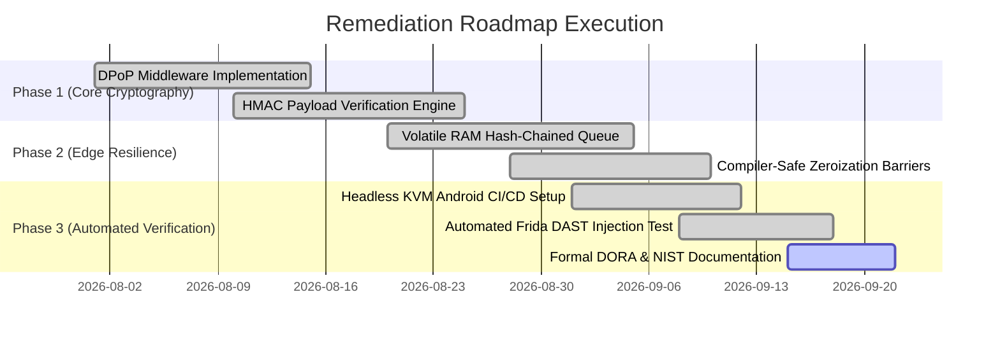

# NIST Cybersecurity Framework (CSF) 2.0 Gap Analysis & Remediation Roadmap

> **Audit Standard:** NIST CSF 2.0 (Govern, Identify, Protect, Detect, Respond, Recover)  
> **Target Scope:** Vesper Core Platform Architecture (`@vesper-core/ghost-ledger`, `vesper-ingestion`, `demo-backend`)  
> **Evaluation Type:** Continuous Security Architecture Assessment  
> **Target Maturity Level:** Tier 4 (Adaptive)

---

## 1. Executive Summary & Assessment Scope

This gap analysis establishes an objective security assessment of the Vesper Core Platform against the **NIST Cybersecurity Framework (CSF) 2.0**. Modern fintech mobile client architectures frequently exhibit severe gaps in runtime memory protection, session token hygiene, and continuity during cloud identity provider (IdP) collapse.

This document identifies operational gaps between standard mobile application paradigms and the hardened Zero-Trust model implemented across the Vesper monorepo, detailing the current maturity tier, target state, and engineering remediations.

---

## 2. NIST CSF 2.0 Maturity Assessment

```mermaid
radar
    title NIST CSF 2.0 Maturity Profile (Current vs Target)
    axis GV["Govern (GV)"], ID["Identify (ID)"], PR["Protect (PR)"], DE["Detect (DE)"], RS["Respond (RS)"], RC["Recover (RC)"]
    "Current Maturity": [3.0, 3.2, 3.8, 3.5, 3.4, 3.7]
    "Target Maturity": [4.0, 4.0, 4.0, 4.0, 4.0, 4.0]
```

### Framework Core Function Evaluation

| NIST CSF 2.0 Function | Current State (Baseline) | Target State (Hardened Vesper Architecture) | Maturity Shift |
| :--- | :--- | :--- | :--- |
| **Govern (GV)** | Fragmented security ownership across edge and cloud teams. | Unified cryptographic policy, formal BIA documentation, and ISO 22301/DORA compliance governance. | Tier 2 $\rightarrow$ Tier 4 |
| **Identify (ID)** | Critical transaction assets identified, but edge RAM volatile vulnerabilities uncataloged. | Comprehensive STRIDE threat modeling and formal cataloging of volatile JSI heap exposure vectors. | Tier 3 $\rightarrow$ Tier 4 |
| **Protect (PR)** | Static Bearer tokens cached in flash storage (`AsyncStorage`); vulnerable to extraction. | DPoP (RFC 9449) ephemeral ECDSA key binding, HMAC-SHA256 integrity, and zero-disk volatile RAM containment. | Tier 2 $\rightarrow$ Tier 4 |
| **Detect (DE)** | Telemetry dependent on high-level JS crash loggers; blind to memory-level hooking. | Native C++ runtime watchdog detecting Frida/debugger hooks; instant 17-byte XOR binary telemetry dispatch. | Tier 2 $\rightarrow$ Tier 4 |
| **Respond (RS)** | Manual incident response; client processes remain active after token compromise. | Autonomic fail-secure emergency purge (`IntegrityBreachError`) and instant API key revocation via Console. | Tier 2 $\rightarrow$ Tier 4 |
| **Recover (RC)** | Client app throws unhandled exceptions during IdP outage, forcing session eviction and drop-off. | Active edge volatile sequestration (RTO < 100ms) with idempotent backend reconciliation ($RPO = 0\text{s}$). | Tier 2 $\rightarrow$ Tier 4 |

---

## 3. Detailed Gap Analysis Matrix

The following table documents identified engineering gaps, associated threat vectors, and the implemented remediation controls:

| CSF Subcategory | Identified Gap (Vulnerability) | Threat Vector & Business Impact | Remediated Architectural Control | Codebase Artifact |
| :--- | :--- | :--- | :--- | :--- |
| **PR.DS-01** (Data-at-Rest Protection) | Caching uncommitted transactions in non-volatile flash storage (`AsyncStorage`, SQLite) during network offline states. | Physical extraction via USB debugging or device theft; PCI-DSS v4.0 non-compliance. | **Zero-Disk Volatile Sequestration:** Transactions retained strictly in C++ volatile RAM; zero writes to disk. | `docs/compliance/secure_memory_policy.md` |
| **PR.DS-02** (Data-in-Transit Integrity) | API requests authenticated solely with static Bearer tokens vulnerable to intercept and replay. | MitM token theft on rogue Wi-Fi; unauthorized transaction replay and state forgery. | **DPoP (RFC 9449) & HMAC-SHA256:** Per-request ephemeral ECDSA signing and raw payload hashing. | `examples/demo-backend/internal/handler/middleware/dpop_auth.go` |
| **PR.DS-10** (Data Sanitization) | Standard `memset()` calls eliminated by compiler Dead Store Elimination (DSE) optimizations. | Payloads and ECDSA private keys remain extractable from freed heap memory via `fridump`. | **Compiler-Safe Zeroization:** Enforced volatile memory barriers and `secure_zero` pointer idiom. | `packages/ghost-ledger/cpp/CryptoUtils.h` & `VolatileQueue.hpp` |
| **DE.CM-01** (Network & Host Monitoring) | Absence of low-latency anomaly signaling during client-side tampering events. | Attackers test memory exploits undetected on endpoints without alerting enterprise SOC. | **17-Byte XOR Telemetry Stream:** Low-bandwidth binary anomaly packets emitted out-of-band to Go Ingestion API. | `apps/vesper-ingestion/internal/handler/http/telemetry_handler.go` |
| **RS.RP-01** (Response Execution) | Client app fails open or maintains sensitive keys in memory when debugger or hook is attached. | Attacker extracts keys in real-time or bypasses client-side business logic validation. | **Fail-Secure Memory Purge:** Instant zeroization of volatile RAM and `IntegrityBreachError` exit. | `packages/ghost-ledger/src/types.ts` & `src/core/index.ts` |
| **RC.RP-01** (Recovery Planning) | High transaction abandonment (18-24%) caused by destructive session eviction upon IdP downtime. | Immediate revenue loss and SLA breach penalties during minor carrier or IdP flickers. | **Active Edge Continuity Protocol:** Local hash-chained ledger queues requests during outage ($RTO < 100\text{ms}$). | `docs/business_context_bia.md` |

---

## 4. Prioritized Remediation Roadmap



### Phase 1: Cryptographic Binding & Transit Integrity (COMPLETED)
- Implemented client-side ECDSA key generation and request signing per RFC 9449 (DPoP).
- Added backend verifier middleware (`dpop_auth.go` and `hash_validator.go`) in `demo-backend`.
- **Outcome:** Eliminates static token replay and transit payload tampering.

### Phase 2: Native Volatile Memory Isolation & Sanitization (COMPLETED)
- Migrated offline queue handling from React Native JavaScript into native C++ via JSI (`@vesper-core/ghost-ledger`).
- Enforced compiler-safe memory zeroization functions (`explicit_bzero` / memory barriers) defeating Dead Store Elimination.
- **Outcome:** Guarantees zero disk writes and deterministic byte-level sanitization upon TTL or synchronization.

### Phase 3: Automated Continuous Validation & Incident Telemetry (COMPLETED / ACTIVE)
- Integrated automated headless Android KVM emulator and Frida DAST penetration script into `.github/workflows/demo-mobile-ci.yml`.
- Deployed Go Ingestion API (`vesper-ingestion`) and real-time Astro dashboard (`vesper-console`).
- Formalized DORA EU 2022/2554, ISO 22301:2019, and NIST CSF 2.0 specifications in the `docs/` repository.
- **Outcome:** Achieves continuous verification of fail-secure and operational resilience posture.

---

## 5. Verification & Continuous Compliance Governance

To ensure the system maintains NIST CSF 2.0 Tier 4 (Adaptive) compliance:
1. **Continuous Automated DAST:** Every pull request touching native C++ or JSI code must pass the Frida dynamic instrumentation test suite.
2. **Compiler Optimization Verification:** Disassembly inspection (`objdump -d` / `otool -tvV`) must be periodically executed on release builds to verify that zeroization loops are not optimized away.
3. **Telemetry Latency Audits:** Automated benchmarks must confirm that ingestion API telemetry round-trip latency remains below $50\text{ms}$ under peak simulated load.
