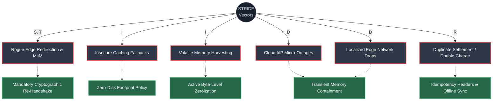

# Threat Modeling and Risk Analysis (STRIDE)

## 1. Executive Summary

This document serves as the formal Threat Modeling and Risk Analysis for the Vesper Core Platform and its edge client ecosystem (`@vesper/ghost-ledger`). It utilizes the **STRIDE** methodology (Spoofing, Tampering, Repudiation, Information Disclosure, Denial of Service, Elevation of Privilege) to systematically identify, categorize, and mitigate operational and cryptographic risks. 

In alignment with Zero-Trust principles, the Vesper architecture is designed to proactively neutralize all identified vectors. Currently, **there are no "Accepted Risks"** within the core transaction flow; all threats are actively mitigated by the cryptographic and architectural controls documented below.

---

## 2. Risk Assessment Methodology

Risk levels are determined using a professional **5x5 Risk Matrix**, calculated by evaluating the **Likelihood** of a threat occurring against the potential business **Impact**.

### 2.1. 5x5 Risk Matrix

| Likelihood \ Impact | Negligible (1) | Minor (2) | Moderate (3) | Major (4) | Critical (5) |
| :--- | :--- | :--- | :--- | :--- | :--- |
| **Almost Certain (5)** | 🟢 Low | 🟡 Medium | 🟠 High | 🔴 Critical | 🔴 Critical |
| **Likely (4)** | 🟢 Low | 🟡 Medium | 🟠 High | 🟠 High | 🔴 Critical |
| **Possible (3)** | 🟢 Low | 🟡 Medium | 🟡 Medium | 🟠 High | 🟠 High |
| **Unlikely (2)** | 🟢 Low | 🟢 Low | 🟡 Medium | 🟡 Medium | 🟠 High |
| **Rare (1)** | 🟢 Low | 🟢 Low | 🟢 Low | 🟡 Medium | 🟡 Medium |

---

## 3. STRIDE Threat Landscape & Mitigations

---

### 3.1. Spoofing & Tampering (S, T)

**Threat: Rogue Edge Redirection & Man-in-the-Middle (MitM)**
* **Description:** An edge device roams into an unverified or malicious network. An attacker attempts to intercept, spoof the server identity, or tamper with the unsubmitted transaction payloads in transit.
* **Likelihood:** Possible (3)
* **Impact:** Critical (5)
* **Inherent Risk:** 🔴 **Critical**
* **Mitigation:** **Mandatory Cryptographic Re-Handshake.** The outbound transport layer remains cryptographically locked post-recovery until a time-variant challenge (DPoP) validates endpoint authenticity. Payload integrity is guaranteed via `X-Sovereign-Hash` (HMAC-SHA256).
* **Residual Risk:** 🟢 **Low**

### 3.2. Repudiation (R)

**Threat: Duplicate Settlement / Double-Charge**
* **Description:** A network dropout occurs precisely between payload authorization and response parsing. The client blindly retries the request upon connection recovery, leading the backend to process the transaction twice while the user claims failure.
* **Likelihood:** Likely (4)
* **Impact:** Major (4)
* **Inherent Risk:** 🟠 **High**
* **Mitigation:** **Idempotency Headers & Offline Ledger Sync.** Transactions are hashed into a deterministic offline ledger block (`SHA256(Payload + PrecedingHash + Timestamp)`). Replays are automatically deduplicated by the `idempotency.go` backend middleware.
* **Residual Risk:** 🟢 **Low**

### 3.3. Information Disclosure (I)

**Threat A: Insecure Caching Fallbacks**
* **Description:** Developers attempting to solve offline transaction drops write raw authorization headers or payloads to physical flash storage (`AsyncStorage`, SQLite).
* **Likelihood:** Possible (3)
* **Impact:** Critical (5) - *PCI-DSS v4.0 / GDPR Violation*
* **Inherent Risk:** 🔴 **Critical**
* **Mitigation:** **Zero-Disk Footprint.** The Vesper SDK natively queues payloads exclusively within volatile RAM boundaries. Disk persistence is entirely prohibited by the architecture.
* **Residual Risk:** 🟢 **Low**

**Threat B: Volatile Memory Harvesting**
* **Description:** Sensitive payloads remain stagnant in RAM indefinitely, leaving them vulnerable to physical RAM scraping or dynamic instrumentation tools (e.g., Frida).
* **Likelihood:** Unlikely (2)
* **Impact:** Major (4)
* **Inherent Risk:** 🟡 **Medium**
* **Mitigation:** **Active Byte-Level Zeroization.** Expired memory buffers are actively overwritten with binary zeroes (`std::fill`) before C++ pointers are discarded, leaving zero forensic trace for memory scrapers.
* **Residual Risk:** 🟢 **Low**

### 3.4. Denial of Service (D)

**Threat A: Cloud IdP Infrastructure Collapse (Micro-Outages)**
* **Description:** Brief but impactful micro-outages or API rate-limiting dropouts at the third-party Identity Provider level, preventing token validation.
* **Likelihood:** Possible (3) - *Accounting for frequent micro-outages*
* **Impact:** Major (4)
* **Inherent Risk:** 🟠 **High**
* **Mitigation:** **Transient Memory Containment.** Transactions are safely suspended within a deterministic Time-To-Live (TTL) window in RAM, maintaining interface responsiveness without triggering application crashes or forcing user eviction.
* **Residual Risk:** 🟢 **Low**

**Threat B: Localized Edge Network Degradation**
* **Description:** Physical environment interference (e.g., concrete tunnels, dense urban centers) causing intermittent multi-step processing gaps.
* **Likelihood:** Almost Certain (5)
* **Impact:** Moderate (3)
* **Inherent Risk:** 🟠 **High**
* **Mitigation:** **Offline Queue Synchronization.** Automatically traps failed requests in C++ memory and processes the synchronized queue sequentially the moment `navigator.onLine` resolves to true.
* **Residual Risk:** 🟢 **Low**

### 3.5. Elevation of Privilege (E)

**Threat: Application Tampering / Malicious Debugging**
* **Description:** An attacker with physical access uses root/jailbreak privileges and debugging tools to bypass local security controls and elevate their transaction privileges.
* **Likelihood:** Unlikely (2)
* **Impact:** Critical (5)
* **Inherent Risk:** 🟠 **High**
* **Mitigation:** **Runtime Anti-Tampering (IntegrityBreachError).** Continuous runtime KVM/Frida cross-testing guarantees the app detects debugging hooks and aggressively terminates the memory lifecycle if an elevation attempt is detected.
* **Residual Risk:** 🟢 **Low**
