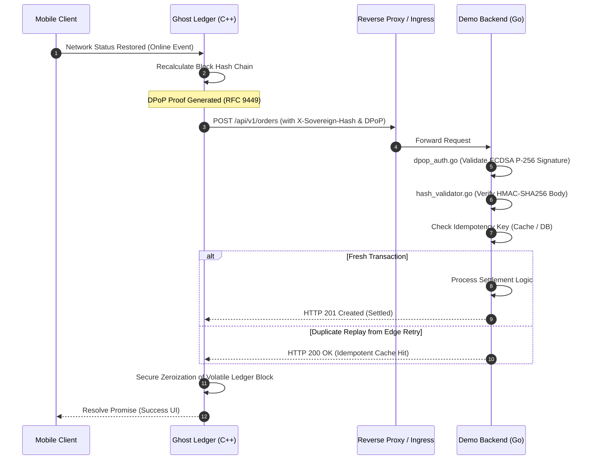

# Operational Business Continuity & Disaster Recovery Runbook (BCP / DRP)

> **Document Classification:** Standard Operating Procedure (SOP)  
> **Target Subsystems:** Edge SDK (`@vesper-core/ghost-ledger`), Ingestion Service (`vesper-ingestion`), Settlement Backend (`demo-backend`), Admin Portal (`vesper-console`)  
> **Audience:** Site Reliability Engineers (SRE), AppSec Incident Response Team, Network Operations Center (NOC)

---

## 1. Purpose & Incident Classifications

This runbook establishes standard operating procedures to maintain transactional continuity and contain security incidents across the Vesper Core Platform. It operationalizes the recovery thresholds defined in the [Business Impact Analysis (BIA)](../business_context_bia.md) ($RTO < 100\text{ ms}$, $RPO = 0\text{ s}$).

### Incident Classification Matrix

```mermaid
graph TD
    Trigger[Incident Trigger] --> ClassA[Class A: Cloud IdP Outage]
    Trigger --> ClassB[Class B: Transport Network Degradation]
    Trigger --> ClassC[Class C: Dynamic Memory Tampering]

    ClassA --> ActA[Action: Edge Volatile Sequestration]
    ClassB --> ActB[Action: Hash-Chained Buffer Retain]
    ClassC --> ActC[Action: Memory Zeroize & Binary Telemetry Alert]

    style Trigger fill:#1e1b4b,stroke:#6366f1,stroke-width:2px;
    style ClassA fill:#111827,stroke:#eab308,stroke-width:1px;
    style ClassB fill:#111827,stroke:#3b82f6,stroke-width:1px;
    style ClassC fill:#450a0a,stroke:#ef4444,stroke-width:2px;
```



| Class | Trigger / Symptoms | Primary Subsystem | Target SLA (RTO) |
| :--- | :--- | :--- | :--- |
| **Class A: Upstream IdP Outage** | External OAuth2/OIDC token endpoints return HTTP 5xx, or DNS resolution fails. | Edge Client SDK (`@vesper-core/ghost-ledger`) | Immediate (< 100ms autonomic edge containment) |
| **Class B: Transport Network Degradation** | Socket drops, TCP timeouts, or carrier flapping during high-value payload transfer. | Edge Client SDK & Transport Gateway | Automatic (< 200ms queue transition) |
| **Class C: Runtime Memory Tampering** | Watchdog detects Frida attachment, JSI function hooking, or debugger attachment. | Native C++ Enclave & `vesper-ingestion` | Immediate (< 2ms zeroization & fail-secure exit) |

---

## 2. Standard Operating Procedures (SOP)

### SOP-01: Class A / B — In-Flight Request Trapping & Edge Sequestration

#### Condition
A mobile client executes a financial checkout or payload submission, but upstream network transport fails (HTTP 502/503/504, connection reset, or gateway timeout).

#### Autonomic Edge Behavior
1. **Interceptor Invocation:** The `@vesper-core/ghost-ledger` networking client intercepts the connection failure.
2. **Payload Enqueueing:** The payload is immediately serialized into an uncommitted block inside the native C++ volatile ledger.
3. **Cryptographic Chaining:** The block is chained using the cryptographic formulation:
   $$H_n = \text{SHA256}(\text{Payload}_n \parallel H_{n-1} \parallel \text{Timestamp}_n)$$
4. **UI Decoupling:** The client SDK suppresses the HTTP error modal and returns a `PendingVerification` status to the React Native UI thread. The end user does **not** experience session eviction.
5. **Deterministic Watchdog:** A 60-second TTL countdown initiates in native RAM.

#### Operator Action (NOC / SRE)
1. Monitor the **Vesper Console** (`vesper-console`) real-time metrics dashboard to distinguish isolated user drops from regional CDN/IdP outages.
2. If IdP recovery exceeds 45 seconds, notify client engineering. The edge SDK will automatically zeroize uncommitted blocks upon reaching 60,000ms TTL to prevent forensic retention.

---

### SOP-02: Class A / B — Reconnection & Idempotent Reconciliation

#### Condition
Carrier connectivity is restored or upstream services recover before the 60-second TTL expires.

#### Sequence of Events


#### Operator Verification
Verify zero duplicate financial entries in backend logs:
```bash
# Query Go backend logs for idempotent deduplication hits
grep "idempotency_key_hit" /var/log/vesper/backend.log
```

---

### SOP-03: Class C — Runtime Tampering & Frida DAST Alert Triage

#### Condition
An attacker attaches dynamic instrumentation tools (Frida, Cycript, Xposed) to the compiled client binary.

#### Autonomic Edge Defense Protocol
1. **Detection:** The native C++ integrity watchdog detects hooked export addresses or memory page permission anomalies.
2. **Immediate Active Zeroization:** The SDK executes `explicit_bzero` / compiler memory barrier across all active cryptographic keys, ECDSA private key structures, and volatile ledger queues.
3. **Out-of-Band Telemetry Emission:** Before process termination, the SDK constructs a 17-byte XOR-encrypted binary packet and emits it directly to the ingestion API:
   ```
   POST /api/v1/support/telemetry
   Content-Type: application/octet-stream
   X-Sovereign-API-Key: <tenant_key>
   [17-byte binary payload]
   ```
4. **Process Termination:** The SDK throws an `IntegrityBreachError` and forcefully terminates the runtime process, leaving an empty heap.

#### SOC / Incident Responder Workflow

```mermaid
graph TD
    Alert[17-Byte XOR Alert Arrives] --> Ingest[vesper-ingestion Decodes Packet]
    Ingest --> DB[(SQLite / Telemetry DB)]
    Ingest --> Metric[OpenTelemetry Counter Increment]
    Metric --> Dashboard[Vesper Console Incident Alert]
    Dashboard --> SOC{SOC Triage}
    SOC -->|Isolated Attack| Monitor[Log Threat Actor Hardware Hash]
    SOC -->|Coordinated Attack / Bulk Keys| Revoke[Emergency API Key Revocation via Console]

    style Alert fill:#450a0a,stroke:#ef4444,stroke-width:2px;
    style Ingest fill:#1e1b4b,stroke:#6366f1,stroke-width:1px;
    style Revoke fill:#b91c1c,stroke:#f87171,stroke-width:2px;
```


1. **Inspect Incident Feed:** Access the **Vesper Console** dashboard (`/metrics` or live alert stream).
2. **Decode Telemetry Packet Details:**
   ```bash
   # CLI inspection of raw telemetry database in vesper-ingestion
   cd apps/vesper-ingestion
   sqlite3 telemetry.db "SELECT id, tenant_id, metric_type, value, timestamp FROM metrics ORDER BY timestamp DESC LIMIT 5;"
   ```
3. **Emergency Key Revocation (Cryptographic Kill-Switch):**  
   If multiple tampering events originate from a compromised client pool or stolen tenant key:
   - Navigate to **Vesper Console > API Keys**.
   - Locate the compromised `X-Sovereign-API-Key`.
   - Click **Revoke** (or issue a `DELETE /api/v1/b2b/keys` call).
   - Once revoked, the Ingestion Gateway immediately rejects all traffic tied to that key, isolating the compromised deployment.

---

## 3. Disaster Recovery Escalation & Contacts

| Role | Escalation Threshold | Contact Channel | SLA Response |
| :--- | :--- | :--- | :--- |
| **Tier 1 (NOC / SRE)** | System outage > 30s or > 100 queued transactions. | `#ops-incident` (Slack) | < 5 minutes |
| **Tier 2 (AppSec / Cryptography)** | Class C tampering alerts > 5 occurrences / hour. | `#sec-emergency` (PagerDuty) | < 10 minutes |
| **Tier 3 (Lead Architect / VP Eng)** | Systemic regional CDN / IdP outage > 15 minutes. | Executive Incident Bridge | < 15 minutes |
