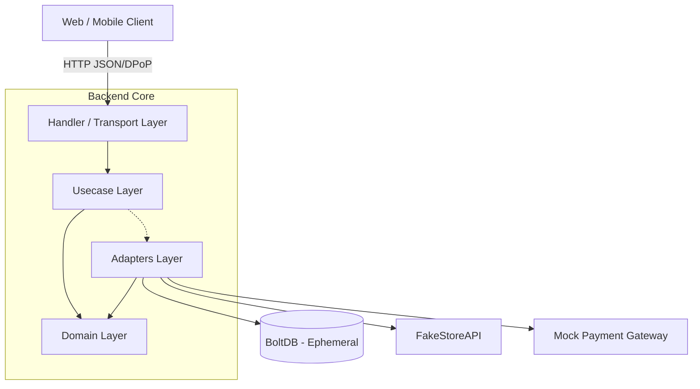
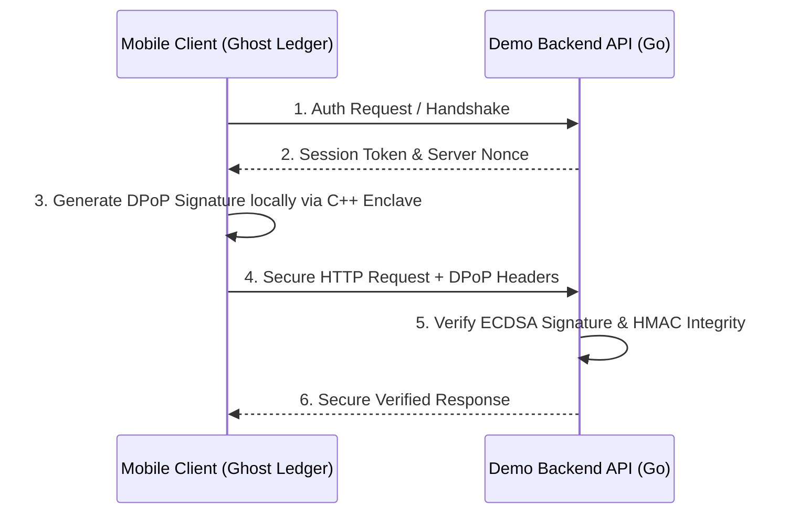

# Vesper Platform - Demo Backend API (`demo-backend`)

> [!WARNING]  
> **THIS IS A SAMPLE BACKEND APPLICATION.**  
> This Go backend is **not** a production-ready template. It serves strictly as a reference implementation to demonstrate how a server should implement the Zero-Trust Architecture, specifically how to validate the ECDSA DPoP signatures and HMAC payloads generated by the `@vesper-core/ghost-ledger` mobile library.

Welcome to the backend reference implementation for the Vesper Platform. This service is built in Go (Golang) and demonstrates a secure E-Commerce backend validating cryptographic requests from the mobile SDK.

## Live Environment

The production build of this backend is continuously deployed on Render. You can interact with the live Swagger documentation here:
**[https://demo-backend-4puz.onrender.com/swagger/index.html](https://demo-backend-4puz.onrender.com/swagger/index.html)**

---

## API Architecture

The API follows **Clean Architecture** principles, divided into discrete layers to maintain decoupling and high cohesion.

- **Domain (`internal/domain`):** The core business logic. Contains the interfaces and data structures (Entities) that model the system, with zero external dependencies.
- **Usecase (`internal/usecase`):** The application logic layer. Contains the business rules (such as block/chain validation) and entity interactions.
- **Handler / Transport (`internal/handler`):** Manages incoming HTTP requests, JSON parsing, security middlewares, and communication with the web/mobile client.
- **Adapters (`internal/adapter` and `internal/store`):** Concrete technological implementations (BoltDB databases, external HTTP gateways, cryptography services).
- **Entrypoint (`cmd`):** Application startup point and dependency injection wiring.

### External Dependencies & Mocks

> [!NOTE]
> **Product Catalog (FakeStoreAPI):** The backend relies on an external API (`https://fakestoreapi.com/products`) via the `FakeStoreGateway` adapter to populate its e-commerce product catalog dynamically. If the external API fails or times out, the backend gracefully degrades to using a local in-memory fallback catalog.
>
> **Payment Processing:** Payments are simulated via the `MockPaymentGateway` adapter which randomly approves or rejects transactions to simulate real-world conditions without touching a real provider.

### Data Storage (Non-Persistent)

> [!IMPORTANT]
> **Ephemeral Database:** This demo uses **BoltDB**, a local, file-based key-value store, as its database adapter. It is designed to be **non-persistent** and ephemeral. 
> 
> Because this is a sample application hosted on cloud platforms without persistent disks (and for ease of local testing), **all data—including user registrations, sessions, and catalog changes—will be permanently lost every time the server is restarted or redeployed.** 

---

## Security Flow (Zero-Trust)

This backend's main purpose is to showcase how to validate client requests using **DPoP (Demonstrating Proof-of-Possession)**. It acts as the verifier of the signatures generated by the `ghost-ledger` mobile engine.

### Advanced Security & Reliability Features

Beyond standard DPoP, this backend implements enterprise-grade middleware (`internal/handler/middleware`) for demonstration:

1. **Strict Idempotency:** The checkout endpoints require an `X-Idempotency-Key`. The middleware computes a composite key combining the header and the **Block Hash** from the mobile ledger to prevent double-charging even if requests are retried during a timeout.
2. **Rate Limiting:** Protects endpoints by IP address (e.g., 100 req/min for public handshakes, 600 req/min for protected endpoints).
3. **Ephemeral JWT Signing:** By default, a new ECDSA private key is generated in memory every time the server starts to sign JWTs. This means sessions invalidate on restart unless the `ECDSA_PRIVATE_KEY_PEM` environment variable is explicitly provided.
4. **HMAC Payload Validation:** Validates that the body of the request matches the signature sent by the mobile client using a shared `PAYLOAD_SECRET_KEY`.

---

## Environment Variables

The server uses the following environment variables. You can configure these in a `.env` file in the root directory.

| Variable | Description |
| :--- | :--- |
| `PORT` | **Optional.** The port the server binds to. Defaults to `8080`. |
| `DB_PATH` | **Optional.** Path to the BoltDB file. Defaults to `./data/sovereign.db`. |
| `PAYLOAD_SECRET_KEY` | **Recommended.** Secret key (min 32 chars) used to validate the HMAC-SHA256 signature of request payloads. If not set, modifying requests will be rejected by the HashValidator. |
| `ECDSA_PRIVATE_KEY_PEM` | **Optional.** Base64URL-encoded DER EC private key. If provided, the server persists JWT signatures across restarts. If missing, an ephemeral key is auto-generated. |

### Development Security Bypasses

Special environment variables are provided to allow seamless local testing (e.g., using Bruno/Postman) without triggering strict cryptographic security blocks.

| Variable | Description |
| :--- | :--- |
| `BUILD_ENV` | Setting this to `development` enables development-only routes (e.g., `POST /api/v1/dev/dpop-token`) which generate valid DPoP tokens automatically for API clients. |
| `DEV_DPOP_BYPASS` | Setting to `true` bypasses the ECDSA signature verification (DPoP). |
| `DEV_HASH_BYPASS` | Setting to `true` bypasses the payload integrity verification (HMAC-SHA256). |

> [!CAUTION]
> These variables bypass all Zero-Trust mechanisms and must **never** be injected or present in a production environment. Furthermore, without these bypasses enabled, testing modifying endpoints via Postman or Bruno is virtually impossible due to the dynamic C++ cryptographic requirements.

---

## Local Development & Commands

To run this backend locally, ensure you have **Go 1.22+** installed. Rename `.env.example` to `.env` in the root of `examples/demo-backend`.

### Run & Build
| Command | Description |
| :--- | :--- |
| `go mod tidy` | Cleans up and installs Go modules dependencies. |
| `go run cmd/server/main.go` | Starts the local development server (default port `8080`). |
| `go build -o bin/server ./cmd/server` | Compiles the backend into a standalone executable binary. |

### Testing & Code Quality
| Command | Description |
| :--- | :--- |
| `go test ./...` | Runs all Unit and Integration tests. |
| `go test -v ./...` | Runs all tests with verbose output. |
| `go test -coverprofile=coverage.out ./...` | Runs tests and generates a test coverage profile. |
| `go tool cover -html=coverage.out` | Opens the generated test coverage report in your web browser. |
| `go fmt ./...` | Formats all Go source files according to standard Go style. |

### Documentation
| Command | Description |
| :--- | :--- |
| `swag init -g cmd/server/main.go` | Generates the Swagger OpenAPI documentation (requires `swaggo/swag` installed globally). |

Once the server is running, the API documentation is available at:
**http://localhost:8080/swagger/index.html**
