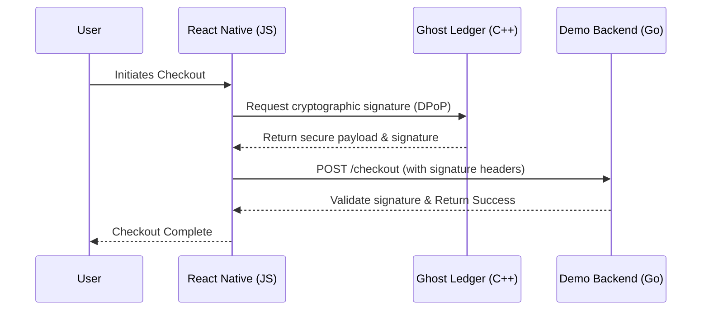

# Demo Mobile App (`demo-mobile`)

> [!WARNING]  
> **THIS IS A SAMPLE APPLICATION.**  
> This mobile app is **not** a production-ready application. It is solely an example and reference implementation demonstrating how to properly integrate and consume the `@vesper-core/ghost-ledger` C++ library within a React Native environment.

Welcome to the React Native (Expo/Bare) mobile application for the Vesper platform. It simulates an e-commerce platform where users can browse a catalog, authenticate, and process payments—showcasing the Zero-Trust cryptographic capabilities of Vesper.

---

## Architecture & Data Flow

The app is built using React Native and leverages the native JSI bindings provided by `ghost-ledger` to perform fast, secure cryptographic operations directly via C++, bypassing the JavaScript bridge for sensitive data.

<strong>View Directory Structure</strong>

| Directory | Description |
| :--- | :--- |
| **`src/features/`** | Contains domain-specific modules such as `auth`, `catalog`, and `payment`. Each module houses its own React components and custom hooks (e.g., `useSovereignCheckout.ts`). |
| **`src/providers/`** | Global context providers. This includes the `SovereignClientContext.tsx` which initializes and exposes the `SovereignClientCore` singleton globally to the app. |
| **`android/` & `ios/`** | The native projects configured to link the C++ static ledger engine seamlessly during the build process. |
| **`scripts/`** | Contains utilities like `frida_dast_test.py` used by the CI/CD pipeline to simulate memory tampering attacks. |

---

## Available Commands

This project includes a comprehensive set of scripts in its `package.json` to handle everything from development to native compilation and testing. 

### Run & Development
| Command | Description |
| :--- | :--- |
| `yarn start` | Starts the Metro Bundler (port 8082). |
| `yarn start:clear` | Starts the Metro Bundler and resets the cache. |
| `yarn android` | Builds and runs the app on an Android emulator/device. |
| `yarn ios` | Builds and runs the app on an iOS simulator. |

### Testing & Code Quality
| Command | Description |
| :--- | :--- |
| `yarn test` | Runs the Jest test suite. |
| `yarn test:coverage` | Runs Jest and collects test coverage. |
| `yarn report` | Generates HTML/text reports for test coverage and ESLint. |
| `yarn test:check` | Executes custom validation script (`scripts/check_tests.js`). |
| `yarn lint` | Runs ESLint on TypeScript files. |
| `yarn lint:fix` | Automatically fixes ESLint errors. |
| `yarn format` | Formats code using Prettier. |

### Native iOS & Android Management
| Command | Description |
| :--- | :--- |
| `yarn nitro` | Executes `react-native nitrogen` for nitro modules. |
| `yarn android:clean` | Runs `gradlew clean` to wipe Android build artifacts. |
| `yarn android:studio` | Displays instructions for opening the project in Android Studio. |
| `yarn ios:pod` | Runs `pod install` in the `ios/` directory. |
| `yarn ios:clean` | Completely removes Pods, `Podfile.lock`, and builds, then reinstalls. |
| `yarn ios:xcode` | Opens the iOS workspace directly in Xcode. |
| `yarn clean:all` | Runs `start:clear` and `android:clean` simultaneously. |

---

## Security Testing & CI/CD Pipeline

Because this app acts as the reference for integrating a security library, it includes a rigorous **CI/CD pipeline** defined in `.github/workflows/demo-mobile-ci.yml`.

### The Pipeline Workflow
Whenever code is pushed, the pipeline automatically:
1. **Lints & Formats:** Verifies code styling (ESLint/Prettier).
2. **Unit Testing:** Runs the Jest test suite ensuring >90% coverage on statements/lines.
3. **DAST (Dynamic Application Security Testing):** This is the most critical step. The pipeline compiles the app and runs a Python script (`scripts/frida_dast_test.py`). 

### Frida Tampering Test
The Python script uses **Frida** to dynamically hook into the running Android application process in the emulator. It attempts to overwrite the C++ Volatile RAM Ledger to simulate a live memory tampering attack. 
If the `@vesper-core/ghost-ledger` library successfully detects this and triggers an `IntegrityBreachError`, the test passes, validating the app's tampering resistance.
