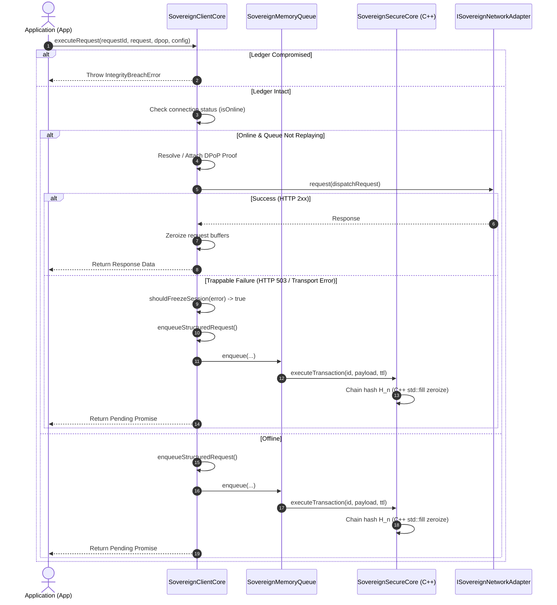

# @vesper/ghost-ledger

`@vesper/ghost-ledger` is a transport-agnostic cryptographic resilience library designed to sequester pending request payloads securely in volatile RAM during connection failures. It guarantees the cryptographic integrity of enqueued transactions.

---

## Core Security Features

The security architecture of the library is built upon 5 fundamental implementation pillars:

1. **Volatile RAM Ledger (C++ Engine Core):** 
   During connectivity failures or transient server responses (such as HTTP 503/504), outgoing requests are serialized to binary format (`Uint8Array`) and enqueued in a native C++ static ledger (`SovereignSecureCore`) in physical RAM (`std::vector<uint8_t>`). Each block is cryptographically linked to its predecessor using chained SHA-256 hashes.

2. **Deterministic Zeroization (Active Memory Erasure):** 
   To prevent credentials or sensitive payloads from lingering in the JavaScript heap, the library enforces active zeroization. The C++ core explicitly calls `std::fill` on all payload vectors, previous hashes, and current hashes immediately after successful dispatch or upon TTL (Time-To-Live) expiration.

3. **Integrity Watchdog (Tamper-Detection Engine):** 
   A background watchdog validates the cryptographic chain of the ledger. If it detects any dynamic memory manipulation (such as injection, memory corruption, or bit-flipping), it instantly freezes queue execution (`isLocked = true`, `isIntegrityCompromised = true`), stopping active TTL timeouts to preserve evidence.

4. **Dynamic DPoP Proofs (Ephemeral Proof-of-Possession):** 
   The library handles the generation and signing of ephemeral OAuth 2.0 Demonstration of Proof-of-Possession (DPoP) proofs (RFC 9449). Ephemeral keys are managed inside TS via platform WebCrypto (`SubtleCrypto`), keeping the C++ core lightweight.

5. **Transport Agnostic Core (Command Pattern Isolation):** 
   The core is decoupled from the network transport layer, utilizing the Command pattern (`() => Promise<T>`) exposed via the `ISovereignNetworkAdapter` interface. This allows developers to plug in clean adapters for various networking stacks—such as Fetch, Axios, and GraphQL.

---

## Architecture & Directory Layout

The directory layout separates JSI JNI wrappers, pure C++ core domain logic, and TypeScript adapters:

```
├── cpp/
│   ├── SovereignSecureClient.h   # JSI Hybrid Object wrapper class definition.
│   ├── SovereignSecureClient.cpp # JSI mapping and core delegation.
│   ├── SovereignSecureCore.h     # Pure standard C++ Core engine definition.
│   └── SovereignSecureCore.cpp   # Core ledger logic and SHA-256 implementation.
├── src/
│   ├── specs/
│   │   └── SovereignSecureClient.nitro.ts # typescript specs contract for Nitrogen.
│   ├── ledger/
│   │   ├── index.ts              # Entry point for the ledger module.
│   │   ├── crypto.ts             # Synchronous SHA-256 fallback algorithm.
│   │   ├── fallback.ts           # SovereignSecureClientFallback pure JS fallback.
│   │   └── queue.ts              # SovereignMemoryQueue: dynamic environment loader.
│   ├── core/
│   │   ├── index.ts              # Entry point for orchestration.
│   │   ├── client.ts             # SovereignClientCore orchestrator class.
│   │   ├── config.ts             # Trapping configurations and HTTP status codes.
│   │   ├── error-matrix.ts       # Transport error matrix decisions.
│   │   └── utils.ts              # DPoP context resolution helpers.
│   ├── dpop/
│   │   ├── index.ts              # Entry point for the DPoP signature engine.
│   │   ├── executor.ts           # Interceptor/executor bridge.
│   │   ├── keys.ts               # Asymmetric keys generation (RSA/EC).
│   │   ├── signer.ts             # JWT proof generator and signer.
│   │   ├── types.ts              # DPoP types.
│   │   └── utils.ts              # DPoP cryptographic utilities.
│   ├── contracts/
│   │   ├── index.ts              # Entry point for abstract interfaces.
│   │   ├── crypto.ts             # Cryptographic provider contracts.
│   │   └── network.ts            # Network transport contracts.
│   ├── adapters/
│   │   ├── index.ts              # Entry point for transport adapters.
│   │   ├── axios/                # Axios adapter and interceptors.
│   │   ├── fetch/                # Fetch adapter and error handlers.
│   │   └── graphql/              # GraphQL client post adapters.
│   ├── binary.ts                 # Binary pack/unpack serialization.
│   ├── index.ts                  # Public library exports surface.
│   └── types.ts                  # Package-wide types and error definitions.
├── CMakeLists.txt                # Unified target-splitting compiler configuration.
└── package.json                  # Package configuration with peerDependencies.
```

---

## Cryptographic Chain Formulation

The in-memory ledger chains each block to its predecessor. The mathematical formulation of the block hashing is:

$$H_n = \text{SHA256}(P_n \parallel H_{n-1} \parallel \text{Timestamp\\_local\\_utf8})$$

### Variable Definitions:
* **$H_n$**: The resulting SHA-256 hash of the current block $n$ (32-byte array).
* **$P_n$**: The binary payload of the current request (`serializedRequest`).
* **$H_{n-1}$**: The SHA-256 hash of the preceding block (or 32-byte zero vector for genesis block).
* **`Timestamp_local_utf8`**: UTF-8 encoded local timestamp string (`timestamp.toString()`).
* **$\parallel$**: Binary concatenation operator.
---

## Operational In-Memory Flow

The sequence diagram below outlines the runtime lifecycle of a request, demonstrating error trapping, memory sequestration, and native C++ core delegation:



---

## Exported API Reference

| Category | Exported Symbol | Type | Description |
| :--- | :--- | :--- | :--- |
| **Core** | `SovereignClientCore` | Class | Main singleton orchestrator. Dispatches/traps requests and manages queue playbacks. |
| **Core** | `SovereignMemoryQueue` | Class | Volatile JSI queue adapter. Controls C++ static ledger blocks and integrity verification. |
| **Network** | `FetchAdapter` / `AxiosAdapter` / `GraphQLAdapter` | Class | Transport adapters implementing request handling over platform HTTP stacks. |
| **Network** | `fetchWithTrapping` / `axiosWithTrapping` / `graphqlWithTrapping` | Function | Interceptor functions mapping HTTP responses and throwing `SovereignHttpError`. |
| **Crypto** | `generateDPoPKeyPair()` | Function | Generates ephemeral RSA/EC asymmetric key pairs. |
| **Crypto** | `withDPoP(client, executor)` | Function | Binds async execution context with lazy-generated DPoP proofs. |
| **Binary** | `serializeAdapterRequest` / `deserializeAdapterRequest` | Function | Packs/unpacks request parameters to/from flat zeroizable binary arrays. |
| **Binary** | `encodeJsonBody` / `encodeTextBody` / `encodeHeaders` / `decodeHeaders` / `decodeBody` | Function | Secure zeroizable buffer formatting and decoding helpers. |
| **Errors** | `SovereignHttpError` | Class | Specialized HTTP status exception indicating trapping eligibility. |
| **Errors** | `IntegrityBreachError` | Class | Fired when watchdog thread detects memory tampering or bit-flips. |
| **Contracts**| `ISovereignCryptoProvider` / `IDPoPCryptoProvider` | Interface | Platform-agnostic cryptographic driver signatures. |
| **Contracts**| `ISovereignNetworkAdapter` | Interface | Abstract transport adapter signature. |
| **Config** | `SovereignClientCoreConfig` / `SessionLifecycleObservers` | Interface | Configuration and observer callback structures. |

---

## Conceptual Usage Examples

### 1. Basic Setup (Offline Queueing & Replay)
```typescript
import { SovereignClientCore, FetchAdapter } from '@vesper/ghost-ledger';

const client = SovereignClientCore.getInstance({
  cryptoProvider: {
    getRandomBytes: (n) => window.crypto.getRandomValues(new Uint8Array(n)),
    sha256: async (d) => new Uint8Array(await window.crypto.subtle.digest('SHA-256', d))
  },
  networkResolver: async () => navigator.onLine,
  networkAdapter: new FetchAdapter(),
  defaultTTL: 60_000,
  telemetry: {
    apiKey: 'your-vesper-api-key',
    bundleId: 'com.your.app',
    endpoint: 'https://api.vesper.local/v1/support/telemetry'
  }
});

// Traps in C++ memory if connection drops
const pendingResponse = client.executeRequest('tx_101', {
  method: 'POST',
  url: 'https://api.sovereign.local/v1/ledger',
  body: new TextEncoder().encode(JSON.stringify({ amount: 500 }))
});

// Replay queue synchronously upon reconnection
await client.processSynchronizedQueue(async () => true);
```

### 2. Axios Integration with Error Trapping
```typescript
import { SovereignClientCore, AxiosAdapter } from '@vesper/ghost-ledger';
import axios from 'axios';

const client = SovereignClientCore.getInstance({
  cryptoProvider: myCryptoProvider,
  networkResolver: async () => true,
  networkAdapter: new AxiosAdapter({ axiosInstance: axios.create() }),
  errorTrapping: { freezeOn503_504: true }
});

client.executeRequest('tx_102', { method: 'POST', url: '/api/ledger/degraded', body: myPayload });
```

### 3. Fetch Integration with Trapping
```typescript
import { SovereignClientCore, FetchAdapter } from '@vesper/ghost-ledger';

const client = SovereignClientCore.getInstance({
  cryptoProvider: myCryptoProvider,
  networkResolver: async () => navigator.onLine,
  networkAdapter: new FetchAdapter()
});

client.executeRequest('tx_103', { method: 'GET', url: 'https://api.sovereign.local/v1/data' });
```

### 4. GraphQL Integration with Trapping
```typescript
import { SovereignClientCore, GraphQLAdapter } from '@vesper/ghost-ledger';

const client = SovereignClientCore.getInstance({
  cryptoProvider: myCryptoProvider,
  networkResolver: async () => navigator.onLine,
  networkAdapter: new GraphQLAdapter({ endpoint: 'https://api.sovereign.local/graphql' })
});

client.executeRequest('tx_104', {
  method: 'POST',
  url: '',
  body: new TextEncoder().encode(JSON.stringify({ query: 'mutation { createTx(amount: 1500) }' }))
});
```

---

## Pure JavaScript Mock Mode

For environments where compile-time native code linking or runtime C++ execution is not possible (such as in pure JavaScript/TypeScript, web applications, or test setups), `@vesper/ghost-ledger` provides a built-in pure JavaScript fallback engine.

This mode skips all attempts to load the native JSI/Nitro modules or Node `.node` addons, preventing Metro/Webpack static analysis or compile-time resolution errors.

### Enabling Mock Mode

You can enable mock mode in one of two ways:

#### 1. Via Client Configuration (Instance Level)
Pass `mock: true` in the `SovereignClientCoreConfig` when instantiating the core client:

```typescript
import { SovereignClientCore } from '@vesper/ghost-ledger';

const client = SovereignClientCore.getInstance({
  cryptoProvider: myCryptoProvider,
  networkResolver: async () => navigator.onLine,
  networkAdapter: new FetchAdapter(),
  mock: true // <-- Force pure JS fallback engine and skip native C++ loading
});
```

#### 2. Via Global Flag (Environment Level)
Define `globalThis.__SOVEREIGN_MOCK__ = true` before the library is imported or evaluated. This is especially useful for setting mock behavior globally across an entire test execution or environment:

```typescript
// Define mock flag globally in your app entrypoint or test setup file
globalThis.__SOVEREIGN_MOCK__ = true;
```

---

## Build Pipelines

```bash
yarn install  # Installs dependencies and generates lockfile
yarn build    # Compiles and outputs type-safe TS build
```
