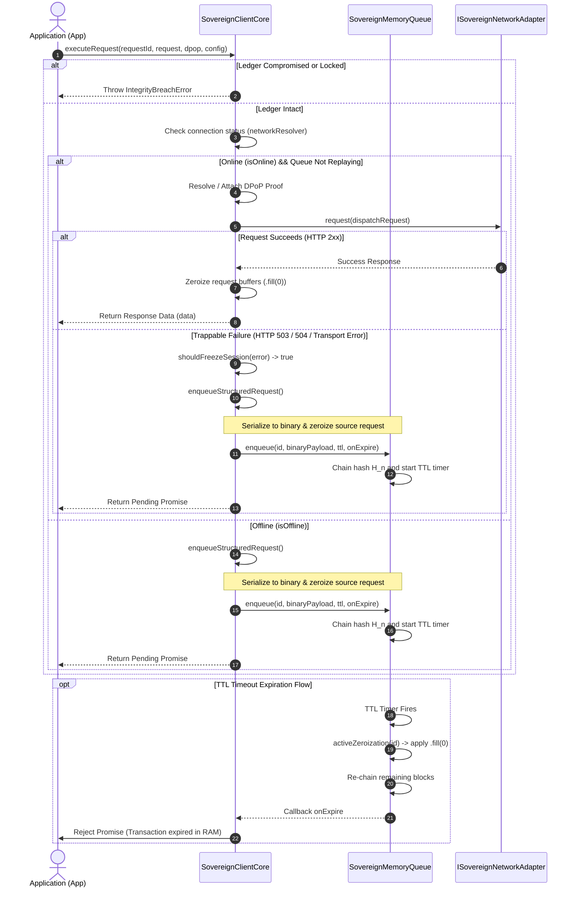

# @sovereign/secure-client

`@sovereign/secure-client` is a transport-agnostic cryptographic resilience library designed to sequester pending request payloads securely in volatile RAM during temporary infrastructure or connection failures. It mitigates heap memory exposure and guarantees the cryptographic integrity of enqueued transactions.

---

## Core Security Features

The security architecture of the library is built upon 5 fundamental implementation pillars:

1. **Volatile RAM Ledger (In-Memory Blockchain):** 
   During connectivity failures or transient server responses (such as HTTP 503/504), outgoing requests are serialized to binary format (`Uint8Array`) and queued sequentially in a volatile memory ledger. Each block is cryptographically linked to its predecessor using chained SHA-256 hashes, constructing a secure blockchain-like ledger directly in RAM.

2. **Deterministic Zeroization (Active Memory Erasure):** 
   To prevent credentials or sensitive payloads from lingering in the JavaScript heap (protecting against heap dumps and cold-boot extraction), the library enforces active zeroization. It explicitly calls `.fill(0)` on all `Uint8Array` buffers containing request payloads, encoded headers, and cryptographic hashes immediately after successful dispatch or upon TTL (Time-To-Live) expiration.

3. **Integrity Watchdog (Tamper-Detection Engine):** 
   A background thread continuously validates the cryptographic chain of the ledger. If it detects any dynamic memory manipulation (such as injection, memory corruption, or bit-flipping attacks), the watchdog instantly freezes queue execution (`isLocked = true`, `isIntegrityCompromised = true`), stops active TTL timeouts to preserve memory evidence for forensic auditing, and notifies the lifecycle observers.

4. **Dynamic DPoP Proofs (Ephemeral Proof-of-Possession):** 
   The library handles the generation and signing of ephemeral OAuth 2.0 Demonstration of Proof-of-Possession (DPoP) proofs in compliance with **RFC 9449**. Upon queue drainage, the library computes fresh asymmetric proof signatures matching the target HTTP method and URL dynamically, using RSA or Elliptic Curve keys managed in hot memory via WebCrypto API (`SubtleCrypto` wrapped by `IDPoPCryptoProvider`).

5. **Transport Agnostic Core (Command Pattern Isolation):** 
   The core is decoupled from the network transport layer, utilizing the Command pattern (`() => Promise<T>`) exposed via the `ISovereignNetworkAdapter` interface. This allows developers to plug in clean adapters for various networking stacks—such as Fetch API (`FetchAdapter`), Axios (`AxiosAdapter`), and GraphQL (`GraphQLAdapter`)—without exposing raw plaintext request payloads or violating binary isolation boundaries.

---

## Architecture & Directory Layout

The codebase follows a clean, modular structure with strictly defined module boundaries:

```
src/
├── adapters/
│   ├── axios/      # Adapter and functional utilities for Axios.
│   ├── fetch/      # Adapter and functional utilities for Fetch API.
│   ├── graphql/    # Adapter and utilities for GraphQL requests.
│   └── index.ts    # Main entry point exporting all network adapters.
├── contracts/
│   ├── crypto.ts   # Platform-agnostic interfaces for cryptographic providers (WebCrypto/SubtleCrypto).
│   ├── index.ts    # Registry of abstraction contracts.
│   └── network.ts  # Types and interfaces for network request/response adapters.
├── core/
│   ├── client.ts   # SovereignClientCore: Orchestrator managing dispatch, replay, and DPoP flows.
│   ├── config.ts   # Normalization of trapping matrices and timeout configurations.
│   ├── error-matrix.ts # Error-trapping decision matrix (401, 503, 504, and transport failures).
│   ├── index.ts    # Main entry point for Core orchestration.
│   └── utils.ts    # Utility helpers for DPoP contexts and memory clearing.
├── ledger/
│   ├── index.ts    # Main entry point for the Ledger subsystem.
│   ├── queue.ts    # SovereignMemoryQueue: RAM queue chaining and watchdog implementation.
│   └── zeroization.ts # Deterministic memory zeroization (.fill(0)) for volatile data.
├── binary.ts       # Serialization helpers isolating headers/body in binary buffers.
├── crypto.ts       # Cryptographic hashing, constant-time equality checks, and genesis vector.
├── index.ts        # Primary package entry point (@sovereign/secure-client).
└── types.ts        # Package-wide type definitions, error classes, and lifecycle observers.
```

---

## Cryptographic Chain Formulation

The in-memory ledger chains each block to its predecessor, ensuring that any payload tampering or block reordering invalidates the chain. The mathematical formulation of the block hashing is:

$$H_n = \text{SHA256}(P_n \mathbin{\Vert} H_{n-1} \mathbin{\Vert} \text{Timestamp\\_local}_{(\text{utf8})})$$

### Variable Definitions:

- **$H_n$**: The resulting SHA-256 hash of the current block $n$ (represented as a 32-byte `Uint8Array`).
- **$P_n$**: The binary payload of the current request (`serializedRequest` encoded as a `Uint8Array`), containing the serialized HTTP method, URL, headers, and body.
- **$H_{n-1}$**: The SHA-256 hash of the preceding block in the ledger. For the genesis block ($n = 0$), this is a 32-byte zero-filled array (`genesisVector`).
- **$\text{Timestamp\\_local}_{(\text{utf8})}$**: The UTF-8 encoded string representation of the local timestamp in milliseconds (`timestamp.toString()`) at which the request was enqueued.
- **$\mathbin{\Vert}$**: The binary concatenation operator (`concatSegments`), merging the buffers sequentially before calculating the SHA-256 digest.

---

## Operational In-Memory Flow

The sequence diagram below outlines the runtime lifecycle of a request from the initial execution, through error trapping and memory sequestration, to successful replay or TTL expiration:



---

## Conceptual Usage

Here is a complete TypeScript example demonstrating how to instantiate `SovereignClientCore` and wrap a generic network request using `.executeRequest()`:

```typescript
import {
  SovereignClientCore,
  FetchAdapter,
  SovereignHttpError
} from '@sovereign/secure-client';
import type {
  ISovereignCryptoProvider,
  NetworkStatusResolver,
  SovereignAdapterRequest
} from '@sovereign/secure-client';

// 1. Define a platform-agnostic crypto provider (browser WebCrypto implementation)
const cryptoProvider: ISovereignCryptoProvider = {
  getRandomBytes: (n: number) => window.crypto.getRandomValues(new Uint8Array(n)),
  sha256: async (data: Uint8Array) => {
    const buffer = await window.crypto.subtle.digest('SHA-256', data);
    return new Uint8Array(buffer);
  }
};

// 2. Define a network status resolver (using navigator.onLine)
const networkResolver: NetworkStatusResolver = async () => {
  return navigator.onLine;
};

// 3. Instantiate the Sovereign Resilience Core Client
const client = SovereignClientCore.getInstance({
  cryptoProvider,
  networkResolver,
  networkAdapter: new FetchAdapter(), // Fetch transport layer
  defaultTTL: 60_000,                  // 60-second default Time-To-Live in RAM
  errorTrapping: {
    freezeOn503_504: true,             // Sequester requests on temporary server errors
    freezeOn401: false,                // Do not freeze session on auth failures
  },
  observers: {
    onSessionFreeze: (reason) => {
      console.warn('Network offline or degraded. Request sequestered in RAM:', reason);
    },
    onSessionResume: () => {
      console.log('Connectivity restored. Queue synchronized successfully.');
    },
    onIntegrityBreach: () => {
      console.error('CRITICAL: In-memory ledger tampering detected! Execution blocked.');
    }
  }
});

// 4. Wrap and dispatch a sensitive request
async function submitTransaction() {
  const transactionId = 'tx_' + Date.now();
  
  // Safe binary encoding of headers and body payloads
  const bodyPayload = new TextEncoder().encode(JSON.stringify({ amount: 1500, currency: 'USD' }));
  const headerPayload = new TextEncoder().encode(JSON.stringify({ 'Content-Type': 'application/json' }));

  const secureRequest: SovereignAdapterRequest = {
    method: 'POST',
    url: 'https://api.sovereign.local/v1/ledger/transactions',
    encodedHeaders: headerPayload,
    body: bodyPayload,
  };

  try {
    const response = await client.executeRequest<{ success: boolean }>(transactionId, secureRequest);
    console.log('Transaction dispatched successfully:', response.success);
  } catch (error) {
    if (error instanceof Error) {
      console.error('Execution failed:', error.message);
    }
  }
}
```

---

## Build Pipelines

Compile and manage the package using standard Yarn commands:

### Install dependencies
```bash
yarn install
```

### Build TypeScript files
```bash
yarn build
```

### Clean and build
```bash
yarn rebuild
```
